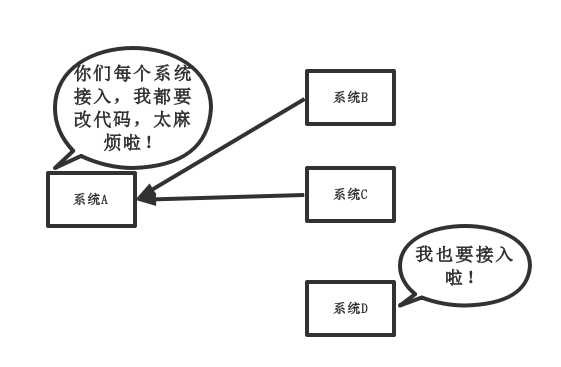
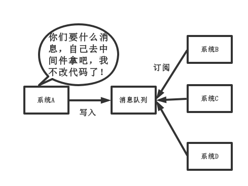
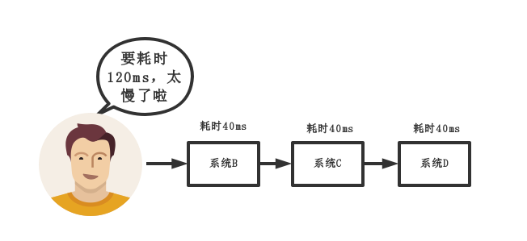

# MQ(消息队列)

## MQ的应用场景

### （1）解耦
传统模式:

传统模式的缺点：

* 系统间耦合性太强，如上图所示，系统A在代码中直接调用系统B和系统C的代码，如果将来D系统接入，系统A还需要修改代码，过于麻烦！

中间件模式:

中间件模式的的优点：

* 将消息写入消息队列，需要消息的系统自己从消息队列中订阅，从而系统A不需要做任何修改。

### （2）异步
传统模式:

### （3）削峰