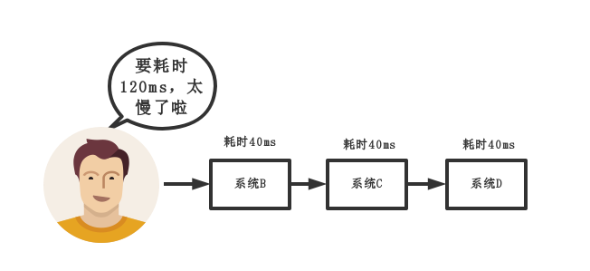
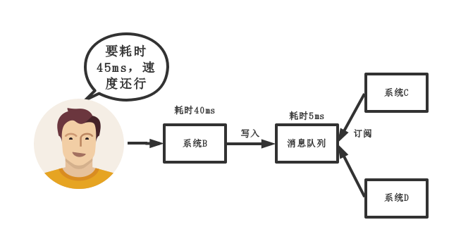
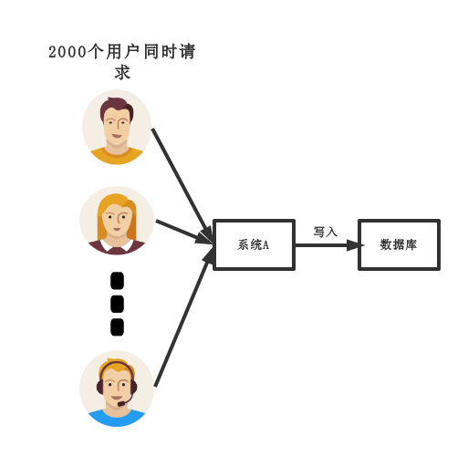
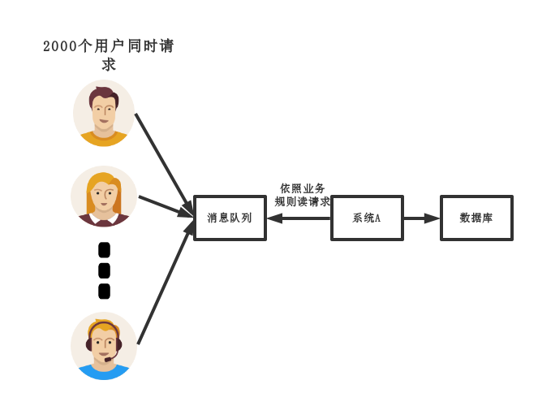

# MQ(消息队列)

## MQ的应用场景

### （1）解耦
传统模式:

传统模式的缺点：

* 系统间耦合性太强，如上图所示，系统A在代码中直接调用系统B和系统C的代码，如果将来D系统接入，系统A还需要修改代码，过于麻烦！

中间件模式:

中间件模式的的优点：

* 将消息写入消息队列，需要消息的系统自己从消息队列中订阅，从而系统A不需要做任何修改。

### （2）异步
传统模式:

传统模式的缺点：

* 一些非必要的业务逻辑以同步的方式运行，太耗费时间。

中间件模式:

中间件模式的的优点：

* 将消息写入消息队列，非必要的业务逻辑以异步的方式运行，加快响应速度
### （3）削峰
传统模式

传统模式的缺点：

并发量大的时候，所有的请求直接怼到数据库，造成数据库连接异常
* 中间件模式:

中间件模式的的优点：

* 系统A慢慢的按照数据库能处理的并发量，从消息队列中慢慢拉取消息。在生产中，这个短暂的高峰期积压是允许的。

## MQ的缺点
#### 系统可用性降低
* MQ如果发生故障，上游服务会导致消息无法发出，然后下游服务无法消费到信息。

#### 系统复杂度提高
* 要多考虑很多方面的问题，比如一致性问题、如何保证消息不被重复消费，如何保证保证消息可靠传输。因此，需要考虑的东西更多，系统复杂性增大。

#### 一致性
* 若下游系统中出现执行失败的情况，导致整个请求返回给用户是成功的，但实际上后台逻辑没有完全执行完。

## 消息队列如何选择

特性 | ActiveMQ | RabbitMQ | RocketMQ | kafka
:-: | :-: | :-: | :-: | :-:
开发语言 | java | erlang | java | scala| 
单机吞吐量 | 万级| 万级 | 10万级 | 10万级|
时效性 | ms级| us级 | ms级 | ms级以内|
可用性 | 高(主从架构)| 高(主从架构) | 非常高(分布式架构) | 非常高(分布式架构)|
功能特性 |成熟的产品，在很多公司得到应用；有较多的文档；各种协议支持较好|基于erlang开发，所以并发能力很强，性能极其好，延时很低;管理界面较丰富| MQ功能比较完备，扩展性佳 | 只支持主要的MQ功能，像一些消息查询，消息回溯等功能没有提供，毕竟是为大数据准备的，在大数据领域应用广。|
缺点 | 偶尔会有较低概率丢失消息；官方社区维护越来越少| us级 | ms级 | ms级以内|
