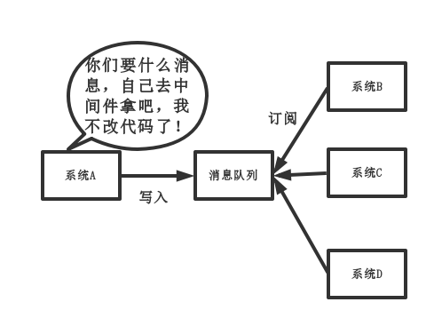

# MQ(消息队列)

## MQ的应用场景

### （1）解耦
传统模式:


传统模式的缺点：

* 系统间耦合性太强，如上图所示，系统A在代码中直接调用系统B和系统C的代码，如果将来D系统接入，系统A还需要修改代码，过于麻烦！

中间件模式:



中间件模式的的优点：

* 将消息写入消息队列，需要消息的系统自己从消息队列中订阅，从而系统A不需要做任何修改。


### （2）异步
传统模式:


传统模式的缺点：

* 一些非必要的业务逻辑以同步的方式运行，太耗费时间。

中间件模式:


中间件模式的的优点：

* 将消息写入消息队列，非必要的业务逻辑以异步的方式运行，加快响应速度
### （3）削峰
传统模式


传统模式的缺点：

并发量大的时候，所有的请求直接怼到数据库，造成数据库连接异常
* 中间件模式:


中间件模式的的优点：

* 系统A慢慢的按照数据库能处理的并发量，从消息队列中慢慢拉取消息。在生产中，这个短暂的高峰期积压是允许的。

## MQ的缺点
#### 系统可用性降低
* MQ如果发生故障，上游服务会导致消息无法发出，然后下游服务无法消费到信息。

#### 系统复杂度提高
* 要多考虑很多方面的问题，比如一致性问题、如何保证消息不被重复消费，如何保证保证消息可靠传输。因此，需要考虑的东西更多，系统复杂性增大。

#### 一致性
* 若下游系统中出现执行失败的情况，导致整个请求返回给用户是成功的，但实际上后台逻辑没有完全执行完。

## 消息队列如何选择

特性 | ActiveMQ | RabbitMQ | RocketMQ | kafka
:-: | :-: | :-: | :-: | :-:
开发语言 | java | erlang | java | scala| 
单机吞吐量 | 万级| 万级 | 10万级 | 10万级|
时效性 | ms级| us级 | ms级 | ms级以内|
可用性 | 高(主从架构)| 高(主从架构) | 非常高(分布式架构) | 非常高(分布式架构)|
功能特性 |成熟的产品，在很多公司得到应用；有较多的文档；各种协议支持较好|基于erlang开发，所以并发能力很强，性能极其好，延时很低;管理界面较丰富| MQ功能比较完备，扩展性佳 | 只支持主要的MQ功能，像一些消息查询，消息回溯等功能没有提供，毕竟是为大数据准备的，在大数据领域应用广。|
缺点 | 偶尔会有较低概率丢失消息；官方社区维护越来越少；适用于小规模吞吐量的场景| 吞吐量会低一些；很难解读源码，很难定制和掌控 | 万一该项目被抛弃，后续没有更新，需要自己维护 | 无|

综合上面的材料得出以下两点:

(1)中小型软件公司，建议选RabbitMQ。一方面，erlang语言天生具备高并发的特性，而且他的管理界面用起来十分方便。正所谓，成也萧何，败也萧何！他的弊端也在这里，虽然RabbitMQ是开源的，然而国内有几个能定制化开发erlang的程序员呢？所幸，RabbitMQ的社区十分活跃，可以解决开发过程中遇到的bug，这点对于中小型公司来说十分重要。不考虑rocketmq和kafka的原因是，一方面中小型软件公司不如互联网公司，数据量没那么大，选消息中间件，应首选功能比较完备的，所以kafka排除。不考虑rocketmq的原因是，rocketmq是阿里出品，如果阿里放弃维护rocketmq，中小型公司一般抽不出人来进行rocketmq的定制化开发，因此不推荐。

(2)大型软件公司，根据具体使用在rocketMq和kafka之间二选一。一方面，大型软件公司，具备足够的资金搭建分布式环境，也具备足够大的数据量。针对rocketMQ,大型软件公司也可以抽出人手对rocketMQ进行定制化开发，毕竟国内有能力改JAVA源码的人，还是相当多的。至于kafka，根据业务场景选择，如果有日志采集功能，肯定是首选kafka了。具体该选哪个，看使用场景。


## 如何保证消息队列的高可用性

### RabbitMQ的高可用性

RabbitMQ是比较有代表性的，因为是基于主从做高可用性的。

RabbitMQ有三种模式：单机模式、普通集群模式、镜像集群模式。

* 单机模式

   就是demo级别的，生产不会用到单机模式。

* 普通集群模式
   
   多台机器上启动多个RabbitMQ实例，每个机器启动一个。**但是创建的queue只会放在一个RabbitMQ实例上，但是每个实例都同步queue的元数据。**服务消费的时候，实际上如果连接到了另外一个实例，那么那个实例会从queue所在的实例上拉取数据过来。**
   
   并没有实现分布式，只是可以提高数据的吞吐量。可能会在RabbitMQ集群内部产生大量的数据传输。可用性没有保障，如果queue所在的节点宕机了，就导致那个queue的数据丢失，没办法消费消息了。

* 镜像集群模式
    
   和普通集群模式不一样的是，你创建的queue无论元数据还是queue里的消息都会存在于多个实例上，每次写消息到queue时，都会自动把消息到多个实例的queue里进行消息同步。
   
   不是分布式的。


### kafka的高可用性

kafka 0.8以后，提供了HA机制，就是replica副本机制。每个partition的数据都会同步到其他机器上，形成自己的多个replica副本。然后所有的replica会选举出一个leader出来，那么生产和消费都跟这个leader打交道，然后其他replica就是follower。写的时候，leader会负责把数据同步到所有的follower上，读的时候就直接读leader上的数据即可。
如果宕机了，partition会重新从follower里选出一个leader，继续读写即可，实现了所谓的高可用性。


## 如何保证消息队列的幂等性
其实无论是那种消息队列，造成重复消费原因其实都是类似的。正常情况下，消费者在消费消息时候，消费完毕后，会发送一个确认信息给消息队列，消息队列就知道该消息被消费了，就会将该消息从消息队列中删除。只是不同的消息队列发送的确认信息形式不同,例如RabbitMQ是发送一个ACK确认消息，RocketMQ是返回一个CONSUME_SUCCESS成功标志，kafka实际上有个offset的概念，简单说一下(如果还不懂，出门找一个kafka入门到精通教程),就是每一个消息都有一个offset，kafka消费过消息后，需要提交offset，让消息队列知道自己已经消费过了。那造成重复消费的原因?，就是因为网络传输等等故障，确认信息没有传送到消息队列，导致消息队列不知道自己已经消费过该消息了，再次将该消息分发给其他的消费者。

如何解决?这个问题针对业务场景来答分以下几点

(1)比如，你拿到这个消息做数据库的insert操作。那就容易了，给这个消息做一个唯一主键，那么就算出现重复消费的情况，就会导致主键冲突，避免数据库出现脏数据。
  

(2)再比如，你拿到这个消息做redis的set的操作，那就容易了，不用解决，因为你无论set几次结果都是一样的，set操作本来就算幂等操作。
  

(3)如果上面两种情况还不行，上大招。准备一个第三方介质,来做消费记录。以redis为例，给消息分配一个全局id，只要消费过该消息，将<id,message>以K-V形式写入redis。那消费者开始消费前，先去redis中查询有没消费记录即可。

## 如何保证消费的可靠性传输

我们在使用消息队列的过程中，应该做到消息不能多消费，也不能少消费。如果无法做到可靠性传输，可能给公司带来千万级别的财产损失。同样的，如果可靠性传输在使用过程中，没有考虑到，这不是给公司挖坑么，你可以拍拍屁股走了，公司损失的钱，谁承担。还是那句话，认真对待每一个项目，不要给公司挖坑。

其实这个可靠性传输，每种MQ都要从三个角度来分析:生产者弄丢数据、消息队列弄丢数据、消费者弄丢数据


### RabbitMQ

#### (1)生产者丢数据

从生产者弄丢数据这个角度来看，RabbitMQ提供transaction和confirm模式来确保生产者不丢消息。
transaction机制就是说，发送消息前，开启事物(channel.txSelect())，然后发送消息，如果发送过程中出现什么异常，事物就会回滚(channel.txRollback())，如果发送成功则提交事物(channel.txCommit())。
然而缺点就是吞吐量下降了。因此，按照博主的经验，生产上用confirm模式的居多。一旦channel进入confirm模式，所有在该信道上面发布的消息都将会被指派一个唯一的ID(从1开始)，一旦消息被投递到所有匹配的队列之后，rabbitMQ就会发送一个Ack给生产者(包含消息的唯一ID)，这就使得生产者知道消息已经正确到达目的队列了.如果rabiitMQ没能处理该消息，则会发送一个Nack消息给你，你可以进行重试操作。处理Ack和Nack的代码如下所示:
```
channel.addConfirmListener(new ConfirmListener() {

@Override
public void handleNack(long deliveryTag, boolean multiple) throws IOException {
System.out.println("nack: deliveryTag = "+deliveryTag+" multiple: "+multiple);
}
 
@Override
public void handleAck(long deliveryTag, boolean multiple) throws IOException {
System.out.println("ack: deliveryTag = "+deliveryTag+" multiple: "+multiple);
}
 
});
```

#### (2)消息队列丢数据

处理消息队列丢数据的情况，一般是开启持久化磁盘的配置。这个持久化配置可以和confirm机制配合使用，你可以在消息持久化磁盘后，再给生产者发送一个Ack信号。这样，如果消息持久化磁盘之前，rabbitMQ阵亡了，那么生产者收不到Ack信号，生产者会自动重发。
那么如何持久化呢，这里顺便说一下吧，其实也很容易，就下面两步：

1、将queue的持久化标识durable设置为true,则代表是一个持久的队列

2、发送消息的时候将deliveryMode=2

这样设置以后，rabbitMQ就算挂了，重启后也能恢复数据

#### (3)消费者丢数据

消费者丢数据一般是因为采用了自动确认消息模式。这种模式下，消费者会自动确认收到信息。这时rabbitMQ会立即将消息删除，这种情况下如果消费者出现异常而没能处理该消息，就会丢失该消息。
至于解决方案，采用手动确认消息即可。


### kafka

#### (1)生产者丢数据

在kafka生产中，基本都有一个leader和多个follwer。follwer会去同步leader的信息。因此，为了避免生产者丢数据，做如下两点配置

* 第一个配置要在producer端设置acks=all。这个配置保证了，follwer同步完成后，才认为消息发送成功。
* 在producer端设置retries=MAX，一旦写入失败，这无限重试


#### (2)消息队列丢数据
针对消息队列丢数据的情况，无外乎就是，数据还没同步，leader就挂了，这时zookpeer会将其他的follwer切换为leader,那数据就丢失了。针对这种情况，应该做两个配置。

* replication.factor参数，这个值必须大于1，即要求每个partition必须有至少2个副本
* min.insync.replicas参数，这个值必须大于1，这个是要求一个leader至少感知到有至少一个follower还跟自己保持联系

这两个配置加上上面生产者的配置联合起来用，基本可确保kafka不丢数据。


#### (3)消费者丢数据
这种情况一般是自动提交了offset，然后你处理程序过程中挂了。kafka以为你处理好了。再强调一次offset是干嘛的

offset：指的是kafka的topic中的每个消费组消费的下标。简单的来说就是一条消息对应一个offset下标，每次消费数据的时候如果提交offset，那么下次消费就会从提交的offset加一那里开始消费。

比如一个topic中有100条数据，我消费了50条并且提交了，那么此时的kafka服务端记录提交的offset就是49(offset从0开始)，那么下次消费的时候offset就从50开始消费。
解决方案也很简单，改成手动提交即可。


## 如何保证消息的顺序性

#### RabbitMQ
保证需要处理的多个数据都放到同一个queue。

#### kafka

##### 单线程

写入一个partition中的数据是有一定顺序的，生产者在写的时候，可以指定一个key，比如你指定某个订单id作为key，这个订单的相关数据一定会被分发到一个partition中，而且这个partition中的数据一定是有顺序的。

消费者从partition中取出来的数据的时候，一定是有顺序的。

##### 多线程

运用内存队列保证数据的有序性。


## 如何解决消息队列积压

* 1、先修复消费者的问题，确保其恢复消费速度，然后将现有的消费者都停掉

* 2、新建一个topic，partition是原来的10倍，临时建立好原先10倍或20倍的queue数量

* 3、然后写一个临时分发数据的消费者程序，把这个程序部署上去，去消费积压的数据，消费之后不做耗时的处理，直接均匀轮询写入临时建好的10倍数量的queue

* 4、接着临时征用10倍的机器来部署消费者，每一批消费者消费一个临时queue的数据

* 5、这种做法相当于是临时将queue和消费者资源扩大10倍，以正常的10倍速度来消费数据

* 6、等快速消费完积压数据后，恢复原先部署架构，重新用原先的消费者机器来消费信息


## 如果让你开发一个消息队列中间件，你会怎么设计架构

### 1、支持可伸缩性

应该设计成分布式系统，参照kafka的设计理念，broker -> topic -> partition，每个partition放一个机器，就存一部分数据。如果资源不够了，就给topic增加partition，然后数据迁移，增加机器，就可以存放更多数据，提高了吞吐量。

### 2、MQ数据落地

数据落地才能保证不会出现进程挂了数据丢失的问题。落库逻辑应该是按顺序写入磁盘，避免随机读写的寻址开销，顺序读写的性能是很高的，这就是kafka的思路。

### 3、可用性

参考kafka的高可用保障机制，采用多副本，挂了重新选举leader即可对外服务。

### 4、支持数据0丢失

参考kafka数据零丢失方案


