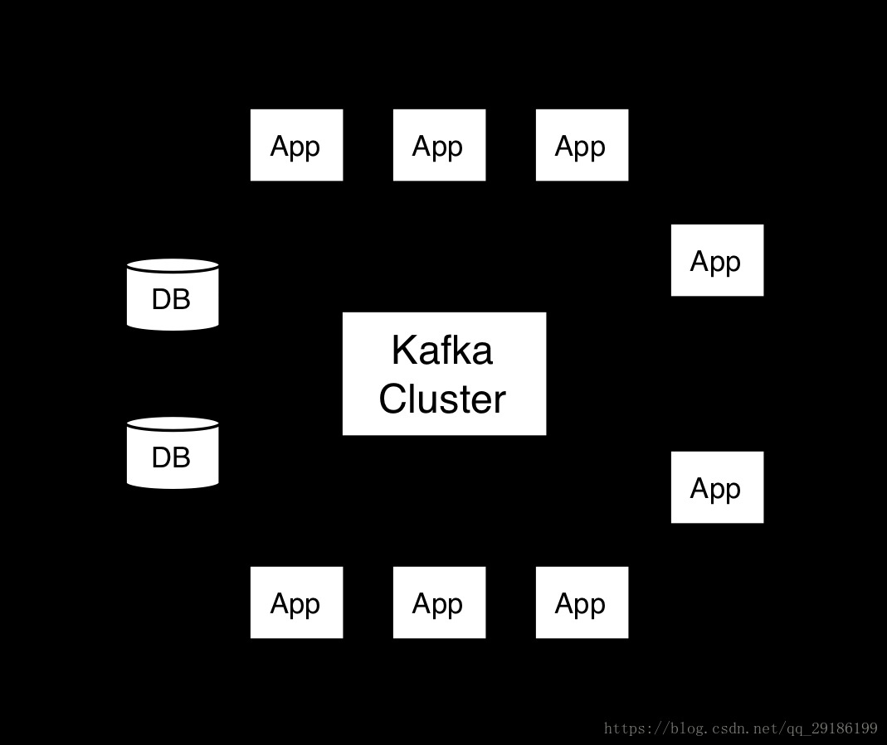
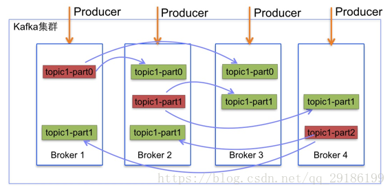
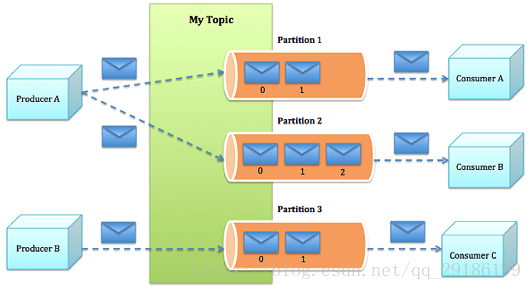
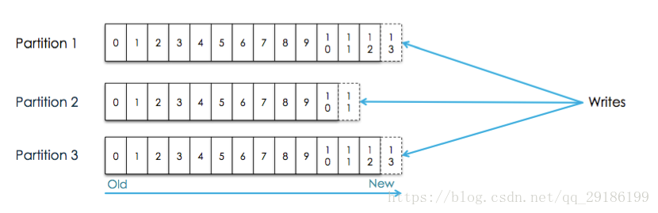
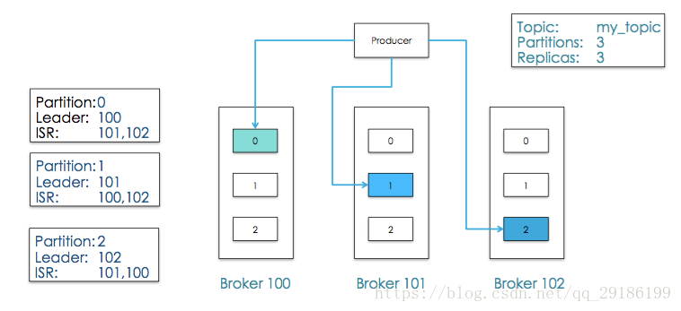
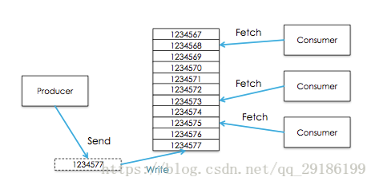
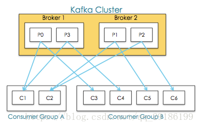
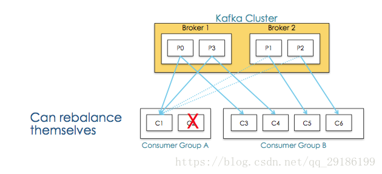

[TOC]

# kafka原理

## 一、kafka原理图

---

## Kafka中的术语

* broker：中间的kafka cluster，存储消息，是由多个server组成的集群。
* topic：kafka给消息提供的分类方式。broker用来存储不同topic的消息数据。
* producer：往broker中某个topic里面生产数据。
* consumer：从broker中某个topic获取数据。

## 二、kafka中的术语设计：

### 1、Broker
      
中间的kafka cluster，存储消息，是由多个server组成的集群。

### 2、topic与消息

kafka将所有消息组织成多个topic的形式存储，而每个topic又可以拆分成多个partition，每个partition又由一个一个消息组成。每个消息都被标识了一个递增序列号代表其进来的先后顺序，并按顺序存储在partition中。

这样，消息就以一个个id的方式，组织起来。

* producer选择一个topic，生产消息，消息会通过分配策略append到某个partition末尾。
* consumer选择一个topic，通过id指定从哪个位置开始消费消息。消费完成之后保留id，下次可以从这个位置开始继续消费，也可以从其他任意位置开始消费。

上面的id在kafka中称为offset，这种组织和处理策略提供了如下好处：

* 消费者可以根据需求，灵活指定offset消费。
* 保证了消息不变性，为并发消费提供了线程安全的保证。每个consumer都保留自己的offset，互相之间不干扰，不存在线程安全问题。
* 消息访问的并行高效性。每个topic中的消息被组织成多个partition，partition均匀分配到集群server中。生产、消费消息的时候，会被路由到指定partition，减少竞争，增加了程序的并行能力。
* 增加消息系统的可伸缩性。每个topic中保留的消息可能非常庞大，通过partition将消息切分成多个子消息，并通过负责均衡策略将partition分配到不同server。这样当机器负载满的时候，通过扩容可以将消息重新均匀分配。
* 保证消息可靠性。消息消费完成之后不会删除，可以通过重置offset重新消费，保证了消息不会丢失。
* 灵活的持久化策略。可以通过指定时间段（如最近一天）来保存消息，节省broker存储空间。
* 备份高可用性。消息以partition为单位分配到多个server，并以partition为单位进行备份。备份策略为：1个leader和N个followers，leader接受读写请求，followers被动复制leader。leader和followers会在集群中打散，保证partition高可用。

### 3、Partitions

每个Topics划分为一个或者多个Partition,并且Partition中的每条消息都被标记了一个sequential id ,也就是offset,并且存储的数据是可配置存储时间的

### 4、producer
producer生产消息需要如下参数：

* topic：往哪个topic生产消息。
* partition：往哪个partition生产消息。
* key：根据该key将消息分区到不同partition。
* message：消息。

## 5、consumer
传统消息系统有两种模式：

* 队列
* 发布订阅

kafka通过consumer group将两种模式统一处理：每个consumer将自己标记consumer group名称，之后系统会将consumer group按名称分组，将消息复制并分发给所有分组，每个分组只有一个consumer能消费这条消息。如下图：

于是推理出两个极端情况：

* 当所有consumer的consumer group相同时，系统变成队列模式
* 当每个consumer的consumer group都不相同时，系统变成发布订阅

注意：

1、Consumer Groups 提供了topics和partitions的隔离， 如上图Consumer Group A中的consumer-C2挂掉，consumer-C1会接收P1,P2，即一个consumer Group中有其他consumer挂掉后能够重新平衡。如下图：

 2、多consumer并发消费消息时，容易导致消息乱序，通过限制消费者为同步，可以保证消息有序，但是这大大降低了程序的并发性。

    kafka通过partition的概念，保证了partition内消息有序性，缓解了上面的问题。partition内消息会复制分发给所有分组，每个分组只有一个consumer能消费这条消息。这个语义保证了某个分组消费某个分区的消息，是同步而非并发的。如果一个topic只有一个partition，那么这个topic并发消费有序，否则只是单个partition有序。

一般消息系统，consumer存在两种消费模型：

* push：优势在于消息实时性高。劣势在于没有考虑consumer消费能力和饱和情况，容易导致producer压垮consumer。
* pull：优势在可以控制消费速度和消费数量，保证consumer不会出现饱和。劣势在于当没有数据，会出现空轮询，消耗cpu。

kafka采用pull，并采用可配置化参数保证当存在数据并且数据量达到一定量的时候，consumer端才进行pull操作，否则一直处于block状态。kakfa采用整数值consumer position来记录单个分区的消费状态，并且单个分区单个消息只能被consumer group内的一个consumer消费，维护简单开销小。消费完成，broker收到确认，position指向下次消费的offset。由于消息不会删除，在完成消费，position更新之后，consumer依然可以重置offset重新消费历史消息。

## 三、消息发送语义

### producer视角

* 消息最多发送一次：producer异步发送消息，或者同步发消息但重试次数为0。
* 消息至少发送一次：producer同步发送消息，失败、超时都会重试。
* 消息发且仅发一次：后续版本支持。

### consumer视角

* 消息最多消费一次：consumer先读取消息，再确认position，最后处理消息。
* 消息至少消费一次：consumer先读取消息，再处理消息，最后确认position。
* 消息消费且仅消费一次。

注意：

* 如果消息处理后的输出端（如db）能保证消息更新幂等性，则多次消费也能保证exactly once语义。
* 如果输出端能支持两阶段提交协议，则能保证确认position和处理输出消息同时成功或者同时失败。
* 在消息处理的输出端存储更新后的position，保证了确认position和处理输出消息的原子性（简单、通用）。

## 四、可用性

    在kafka中，正常情况下所有node处于同步中状态，当某个node处于非同步中状态，也就意味着整个系统出问题，需要做容错处理。

同步中代表了：

* 该node与zookeeper能连通。
* 该node如果是follower，那么consumer position与leader不能差距太大（差额可配置）。

某个分区内同步中的node组成一个集合，即该分区的ISR。

kafka通过两个手段容错：

* 数据备份：以partition为单位备份，副本数可设置。当副本数为N时，代表1个leader，N-1个followers，followers可以视为leader的consumer，拉取leader的消息，append到自己的系统中

* failover：

    1. 当leader处于非同步中时，系统从followers中选举新leader

    2. 当某个follower状态变为非同步中时，leader会将此follower剔除ISR，当此follower恢复并完成数据同步之后再次进入 ISR。

另外，kafka有个保障：当producer生产消息时，只有当消息被所有ISR确认时，才表示该消息提交成功。只有提交成功的消息，才能被consumer消费。

因此，当有N个副本时，N个副本都在ISR中，N-1个副本都出现异常时，系统依然能提供服务。

假设N副本全挂了，node恢复后会面临同步数据的过程，这期间ISR中没有node，会导致该分区服务不可用。kafka采用一种降级措施来处理：选举第一个恢复的node作为leader提供服务，以它的数据为基准，这个措施被称为脏leader选举。由于leader是主要提供服务的，kafka broker将多个partition的leader均分在不同的server上以均摊风险。每个parition都有leader，如果在每个partition内运行选主进程，那么会导致产生非常多选主进程。kakfa采用一种轻量级的方式：从broker集群中选出一个作为controller，这个controller监控挂掉的broker，为上面的分区批量选主。

## 五、一致性
上面的方案保证了数据高可用，有时高可用是体现在对一致性的牺牲上。如果希望达到强一致性，可以采取如下措施：

* 禁用脏leader选举，ISR没有node时，宁可不提供服务也不要未完全同步的node。
* 设置最小ISR数量min_isr，保证消息至少要被min_isr个node确认才能提交。

## 六、持久化
基于以下几点事实，kafka重度依赖磁盘而非内存来存储消息。

* 硬盘便宜，内存贵
* 顺序读+预读取操作，能提高缓存命中率
* 操作系统利用富余的内存作为pagecache，配合预读取(read-ahead)+写回(write-back)技术，从cache读数据，写到cache就返回（操作系统后台flush)，提高用户进程响应速度
* java对象实际大小比理想大小要大，使得将消息存到内存成本很高
* 当堆内存占用不断增加时，gc抖动较大
* 基于文件顺序读写的设计思路，代码编写简单
* 在持久化数据结构的选择上，kafka采用了queue而不是Btree
* kafka只有简单的根据offset读和append操作，所以基于queue操作的时间复杂度为O(1),而基于Btree操作的时间复杂度为O(logN)
* 在大量文件读写的时候，基于queue的read和append只需要一次磁盘寻址，而Btree则会涉及多次。磁盘寻址过程极大降低了读写性能

