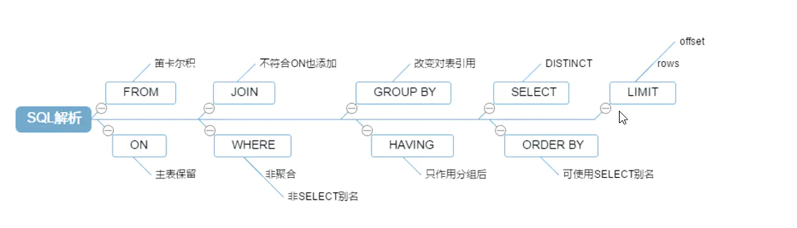
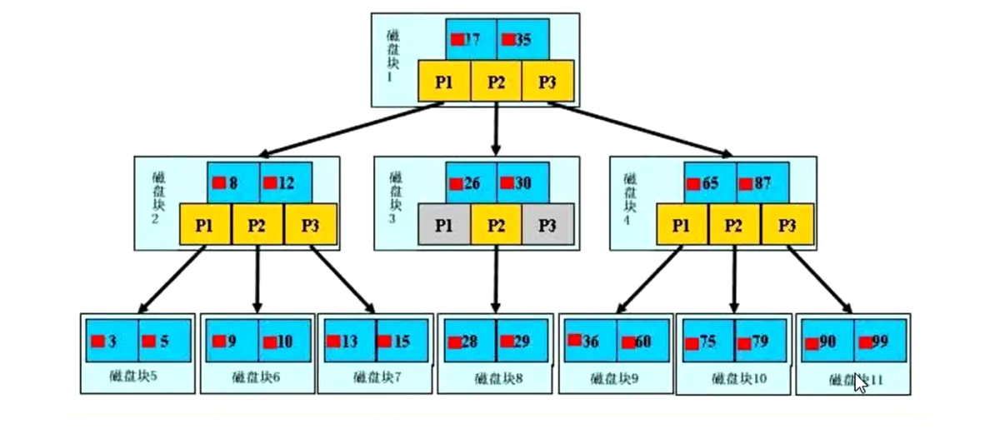
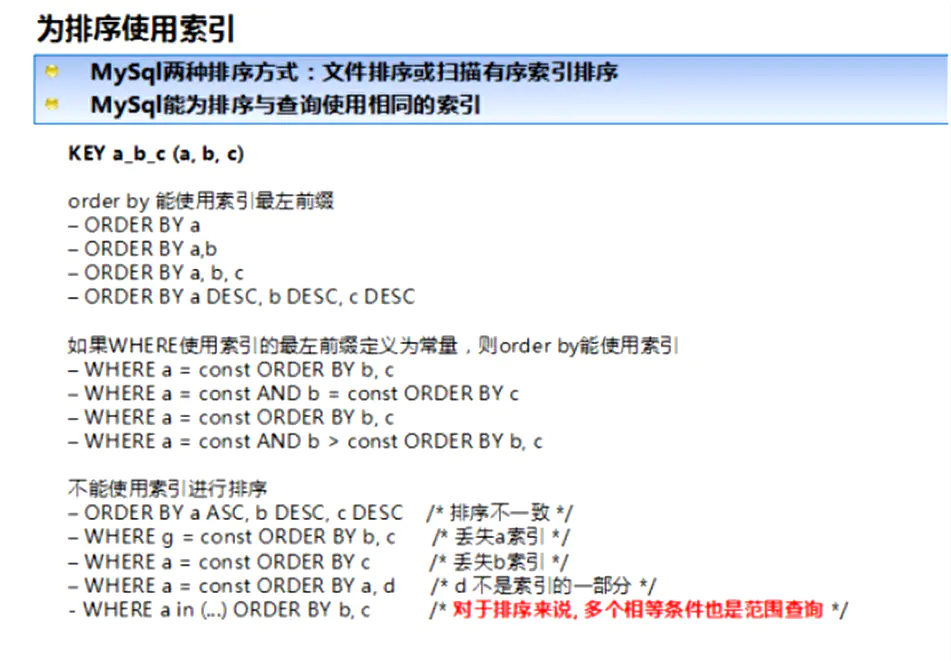

# MySQL进阶

[toc]

## 一、SQL执行顺序以及常见SQL的join查询

#### sql执行顺序：

手写
```
SELECT DISTINCT
         <select_list>
FROM
          <left table> <join type>
JOIN <right_table> ON <join_codition>
WHERE
          <where_condition>
HAVING
          <having_condition>
ORDER BY
          <  order_by_condition>
LIMIT       < limit number>
```

机读顺序

```
1 FROM <left_table>

2 ON <join_condition>

3 <join_type> JOIN <right_table>

4 WHERE <where_condition>

5 GROUP BY <group by_list>

6 HAVING <having_condition>

7 SELECT

8 DISTINCT <select_list>

9 ORDER BY <order_by_condition>

10 LIMIT <limit_number>
```

* sql机器执行顺序



## 二、索引

### 1、什么是索引

索引是帮助MYSQL高效获取数据的数据结构-->排好序的快速查找数据结构

我们平时所说的索引，没有特别指明，都是指B树（多路搜索树，不一定是二叉）

结构组织的索引。其中聚集索引，次要索引，覆盖索引，复合索引，前缀索引，唯一索引默认都是使用B+树索引，统称索引，除了B+树这种类型的索引外，还有哈希索引等。

### 2、优势：

类似大学图书馆书目索引，提高数据检索效率，降低数据库的io成本

通过索引列对数据进行排序，降低数据排序的成本，降低了CPU的消耗

### 3、劣势：

实际上索引也是一张表，该表保存了主键与索引字段，并指向实体表的记录，所以索引列也是要占用空间的

虽然索引大大提高了查询速度，同时却会降低更新表的速度，如对表进行INSERTE,UPDATE,和DELETE。因为更新表时，MYSQL不仅要保存数据，还要保存一下索引文件每次更新添加了索引列的字段，都会调整因为更新所带来的键值变化后的索引信息。（维护B+树索引结构）

索引只是提高效率的一个因素，如果你的MYSQL有大数据量的表，就需要花时间研究建立最优秀的索引，或优化查询语句

### 4、索引分类：
单值索引：即一个索引只包含单个列，一个表可以有多个单列索引
唯一索引：索引列的值必须唯一，但允许有空值
复合索引：即一个索引包含多个列

### 5、基本语法：

创建：

CREATE [UNIQUE] INDEX indexName ON myTable(clumn name(length));

使用ALTER命令创建：

1、添加主键（意味着索引值必须唯一，且不能为NULL）

ALTER TABLE mytable ADD PRIMARY KEY(column_list)

2、创建唯一索引（索引值唯一，可以为NULL,为NULL可重复出现）

ALTER TABLE mytable ADD UNIQUE index_name (column_list)

3、添加普通索引（索引值可以出现多次）

ALTER TABLE mytable ADD INDEX index_name(column_list)

4、指定索引为FULLTEXT,用于全文索引

ALTER TABLE mytable ADD FULL TEXT index_name(column_list)

删除：

DROP INDEX [indexName] ON mytable;

查看：

SHOW INDEX FROM table_name

### 6、索引结构原理：

BTREE索引：



浅蓝色的块--->磁盘块

黄色的块------>指针

深蓝色的块----->数据项

P1表示小于17的磁盘块，P2表示在17和35之间的磁盘块，P3表示大于35的磁盘块

真实的数据库都存在与叶子节点，非叶子节点不存储真实的数据，只存储指引搜索方向的数据项

**查找过程：**

如果要查找数据项29，那么首先会把磁盘块1由磁盘加载到内存，此时发生一个IO,在内存中用二分继续查找确定19在17和35之间，锁定磁盘块1的P2指针，内存实践相比磁盘IO可忽略不计。通过磁盘块1的P2指针的磁盘地址把磁盘块3由磁盘加载到内存，发生第二次IO,二分确定29在26和30之间，锁定磁盘块3的P2指针，通过指针加载磁盘块8到内存，发生第三次IO,同时在内存中二分查找到29，结束，总计三次io

**哪些情况需要创建索引？**

1、主键自动建立唯一索引

2、频繁作为查询条件的字段应该创建索引

3、查询中与其他表关联的字段，外键关系建立索引

4、频繁更新的字段不适合创建索引（因为每次更新都要维护索引结构）

5、where条件里用不到的字段不创建索引

6、在高并发下倾向创建组合索引

7、查询中排序的字段，排序字段若通过索引去访问将大大提高排序速度

8、查询中统计或者分组字段

**哪些情况下不适合创建索引**

1、表记录太少

2、经常增删改的表

3、数据重复且分布平均的表字段，因此应该只为最经常查询和最经常排序的数据列建立索引。（如果某个数据列包含许多重复的内容，为它建立索引就没有太大的实际效果）

## 三、sql性能分析

### 1、Sql性能下降原因：

1、查询语句写的太烂

2、索引失效

3、关联查询包含太多的join

4、服务器调优及各个参数的设置（缓冲、线程数等）

### 2、explain关键字：

**定义**

使用EXPLAIN关键字可以模拟优化器执行SQL查询语句，从而知道MYSQL是如何处理你的SQL语句的。分析你的查询语句或是表结构的性能瓶颈

**作用**

1、能够获取表的读取顺序

2、能够获取数据读取操作的操作类型

3、能够获取哪些索引可以使用

4、能够获取哪些索引被实际是使用

5、能够获取表之间的引用

6、能够获取每张表有多少行被优化器查询

**命令**

explain sql语句;

使用explain所获取到的执行计划包含的信息：


**执行计划信息各字段解释**

**id**

含义：select查询的序列号，包含一组数字，表示查询中执行select子句或操作表的顺序

作用：解释表的读取顺序

三种情况：

1、id相同，执行顺序由上至下

2、id不同，如果是子查询，id序号会递增，id值越大优先级越高，越先被执行

3、id有相同有不同，优先级越大的越先执行，相同的自上而下执行

**select_type**

含义：查询的类型，主要用于区别普通查询、联合查询、子查询等复杂查询

作用：解释数据读取操作的操作类型

类型：

1.SIMPLE:简单的select查询，查询中不包含子查询或者UNION

2.PRIMARY:查询中包含任何复杂的子部分，最外层查询被标记为PEIMARY(即最后加载执行的表)

3.SUBQUERY:在SELECT或WHERE列表中包含的子查询

4.DERIVED:在FROM列表中包含的子查询被标记为DERIVED(衍生) MYSQL会递归执行这些子查询，把结果放在临时表中

5.UNION:若第二个SELECT出现在UNION之后，则被标记为UNION;若UNION包含在FROM子句的子查询中，外层SELECT将被标记为DERIVED

6.UNION RESULT：从UNION表获取结果的SELECT

**table**

作用：标注数据来源哪张表

**type**

作用：显示查询使用了何种类型

类型性能排序：system > const > eq_ref >ref >range >index > ALL

一般情况保证查询至少达到range级别

类型解读：

system:表只有一行记录（等于系统表），这是const类型的特例，平时不会出现，这个可以忽略不计

const:表示通过索引一次就找到了，const用于比较primary key或者unique索引。因为只匹配一行数据，所以很快。如将主键置于where条件查询中，MYSQL就能将该查询转换为一个常量

eq_ref:唯一性索引扫描，对于每个索引键，表中只有一条记录与之匹配。常见于主键或唯一索引扫描

ref:非唯一性扫描，返回匹配某个独有值得所有行。本质上也是一种索引访问，它返回所有匹配某个单独值得行。

range:只检索给定范围得行，使用一个索引来选择行。key列显示了使用了哪个索引。一般就是在你的where语句中出现了between ，<， >， in等得查询

index:FULL INDEX SCAN ,index与ALL区别为index类型只遍历索引树。这通常比ALL块，因为索引文件通常比数据文件小。

ALL:FULL TABLE SCAN 将遍历全表找到匹配得行

possible_keys:作用：显示可能应用在这张表中得索引，一个或多个。查询涉及到得字段上若存在索引，则该索引将被列出。但不一定被实际查询中用到

**key**

作用 ：表明实际查询中用到得索引

情况：

NULL:没有使用索引（要么没建索引，要么没用索引，要么用了索引失效）

注意：如果使用了覆盖索引：则possible_keys为null，而key有值

覆盖索引：即查询得字段得顺序与个数与建立得复合索引一致

key_len

含义：表示索引中使用得字节数，可通过该列计算查询中使用得索引得长度。在不损失精确性得情况下，长度越短越好。key_len显示得值为索引字段得最大可能长度，并非实际使用长度。即key_len是根据表定义计算而得，不是通过表内检索出得

ref

含义：显示索引得哪一列被使用了，如果可能得话，是一个常数。哪些列或常量被用于查找索引列上得值

rows

含义：根据表统计信息及索引选用大致估算找到所需记录所需要读取得行数

Extra

含义：包含不适合在其他列中显示但是又十分重要得额外信息

取值

1.Using filesort:说明MySQL会对数据使用一个外部得索引排序，而不是按照表内得索引顺序进行读取。即MySQL中无法利用索引完成得排序操作称为”文件排序“ （绝对避免）

2.Using temporary： 使用了临时表保存中间结果，Mysql在对查询结果排序时使用临时表。常见于排序order by 和分组查询group by (不可以有)

3.USING index：表示相应得select操作中使用了覆盖索引，避免访问了表得数据行，效率不错。如果同时出现using where表命索引被用来执行索引键值得查找；如果没有出现using where 表命索引用来读取数据而非执行查找动作。（好现象）

4.Using where:表明使用了where过滤

5.using join buffer:表明使用了连接缓存

6.impossible where : where子句得值总为false，不能获取到任何元组

7.select tables optimized away

8.distinct：优化distinct操作，在找到第一匹配得元组后即停止找同样得动作

**join语句优化总结：**

1.尽可能减少join语句中得NestedLoop得循环总次数：“永远用小结果驱动大的数据集”

优先优化NestedLoop得内层循环

2.保证join语句中被驱动表上join条件字段已经被索引

3.当无法保证被驱动表得join条件字段被索引且内存资源充足得前提下，不要吝啬joinBuffer得设置

两表关联查询：

左连接，索引建在右表；右连接，索引建在左表

三表关联查询：

左连接，索引建在右边两张表；右连接，索引建在左边两张表

### 四、 索引优化（解决or避免索引失效）

1.最佳左前缀法则：如果索引了多列（复合索引），要遵守最左前缀法则。指的是查询从复合索引的最左列开始并且不跳过复合索引中得列（防止索引失效）

2.不要再索引列上做任何操作（计算、函数、（自动or手动）类型转型），会导致索引失效而转向全表扫描

3.存储引擎不能使用索引中范围条件右边的列。即复合索引中若复合索引中某个列参与了范围条件则该列后的所有列都会索引失效

例：复合索引--->(column1,column2,column3)，若有条件查询 where cloumn1 = value1 and cloumn2>1 and column3=values3 则column3将失效

4.尽量使用覆盖索引（只访问索引的查询（索引列和查询列一致）），避免select *

5..mysql在使用不等于（!= 或者<>）的时候会导致索引失效而全表扫描

6.is null 或者 is not null 都会导致索引失效

7.like以通配符开始('%abc%')MySQL索引会失效而导致全表扫描。但是通配符只在右边出现不会导致索引失效（即通配符不可以出现在最左边）

解决like '%字符串.....'索引失效问题：使用覆盖索引，或者查询复合索引中部分列

8.字符串不加单引号会导致索引失效

9.少用or，用它连接时会导致索引失效

### 五、查询截取分析

#### 查询优化
##### 1.切记小表驱动大表

* in 和 exist用法场景区分：

select * from A where A.id in (select id from B)

当B表数据集小于A表数据集时,用in 优与exist

select * from A where exist (select 1 from B where B.id = A.id)

当A表数据集小于B表数据集时，用exist优与in

##### 2.order by 关键字优化

mysql排序使用index和filesort两种方式。尽量使用using Index,避免出现using filesort

order by在满足下列条件会使用index方式排序：

1）order by 语句使用索引最左前列

2）使用Where子句和order by子句条件列组合满足索引最左前列

如果order by字段不在索引列上，filesort有两种算法：

双路排序：mysql4.1之前的算法

单路排序：mysql4.1之后出现。从磁盘读取查询需要的所有列，按照order by 列在buffer对它们进行排序，然后扫描排序后的列表进行输出。

 

##### 3.group by 关键字优化

group by 实质是先排序后进行分组，遵照索引键的最佳左前缀，where高于having能写在where限定的条件就不要使用having了

### 六、 Mysql锁机制

#### 定义
锁是计算机协调多个进程或线程并发访问某一资源的机制

在数据库中，除传统的计算资源（CPU，RAM,I/O等）的争用以外，数据也是一种供许多用户共享的资源。如何保证数据兵法访问的一致性、有效性是所有数据库必须解决的一个问题，锁冲突也是影响数据库兵法访问性能的一个重要因素。从这个角度来说，锁对数据库而言显得尤其重要也更加复杂。

#### 锁的分类

* 从对数据操作的类型上分为读锁和写锁

    读锁（共享锁）：针对同一份数据，多个读操作可以同时进行而不会互相影响

    写锁（排他锁）：当前写操作没有完成前，它会阻断其他写锁和读锁。

* 从对数据操作的粒度分为表锁和行锁

##### 1、表锁

特点：偏向MyISAM存储引擎，开销小，加速块；无死锁；锁定粒度大，发生锁冲突的概率最高，并发度最低。

命令：
加锁： lock table 表名1 read/write，表名2 read/write......
查看表加锁情况：show open tables;有锁时In_user = 1
释放表锁：unlock tables

读锁：表被某一会话加上读锁后，大家都可以读数据，但是不可以写（包括加锁者，且加锁者会话不可以再操作其他表），其他会话发起写数据请求将被阻塞到表锁被释放。

写锁：表被某一会话加上写锁后，加锁者会话可以对此表进行读操作，但不可以再操作其他表。而其他会话 对此表进行写操作，读操作将被阻塞至写锁被释放。

总结：读锁会阻塞写，但是不会阻塞读；而写锁 会阻塞读和写

##### 2、行锁

特点：偏向InnoDB存储引擎，开销大，加锁慢；会出现思索；锁定力度最小，发生锁冲突的概率最低，并发度也最高

注意：当索引失效或者无索引时时会导致行锁变为表锁

##### 3、间隙锁

定义

当我们用范围条件而不是相等条件检索数据，并请求共享或排他锁时，InnoDB会给符合条件的已有数据记录的索引项加锁；对于键值在条件范围内但不存在的记录，叫做：“间隙（GAP）”

InnoDB也会对这个间隙锁加锁

危害：

因为Query执行过程中通过范围查找的话，他会锁定整个范围内所有的索引键值，即使这个键值不存在。

间隙锁有一个比较致命的弱点，就是当锁定一个范围键值之后，及时某些不存在键也会被无辜锁定，而造成在锁定的时候无法插入锁定键值范围内的任何数据。在某些场景下这可能会对性能造成很大的危害

优化建议
1. 尽可能让所有数据检索都通过索引来完成，避免无索引行锁升级为表锁
2. 合理设计索引，尽量缩小锁的范围
3. 尽可能减少检索条件，避免间隙锁
4. 尽量控制事物大小，减少锁定资源量和时间长度
5. 尽可能低级别事物隔离


