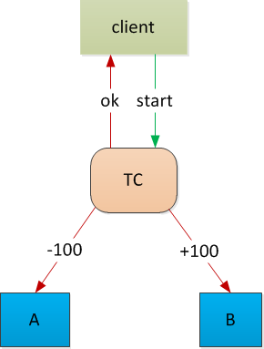
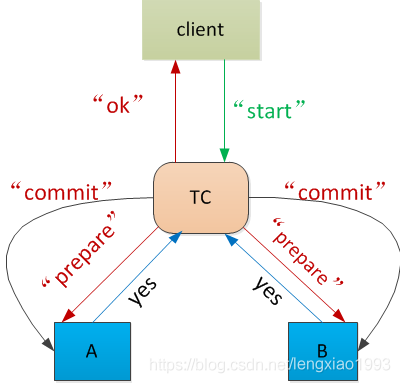
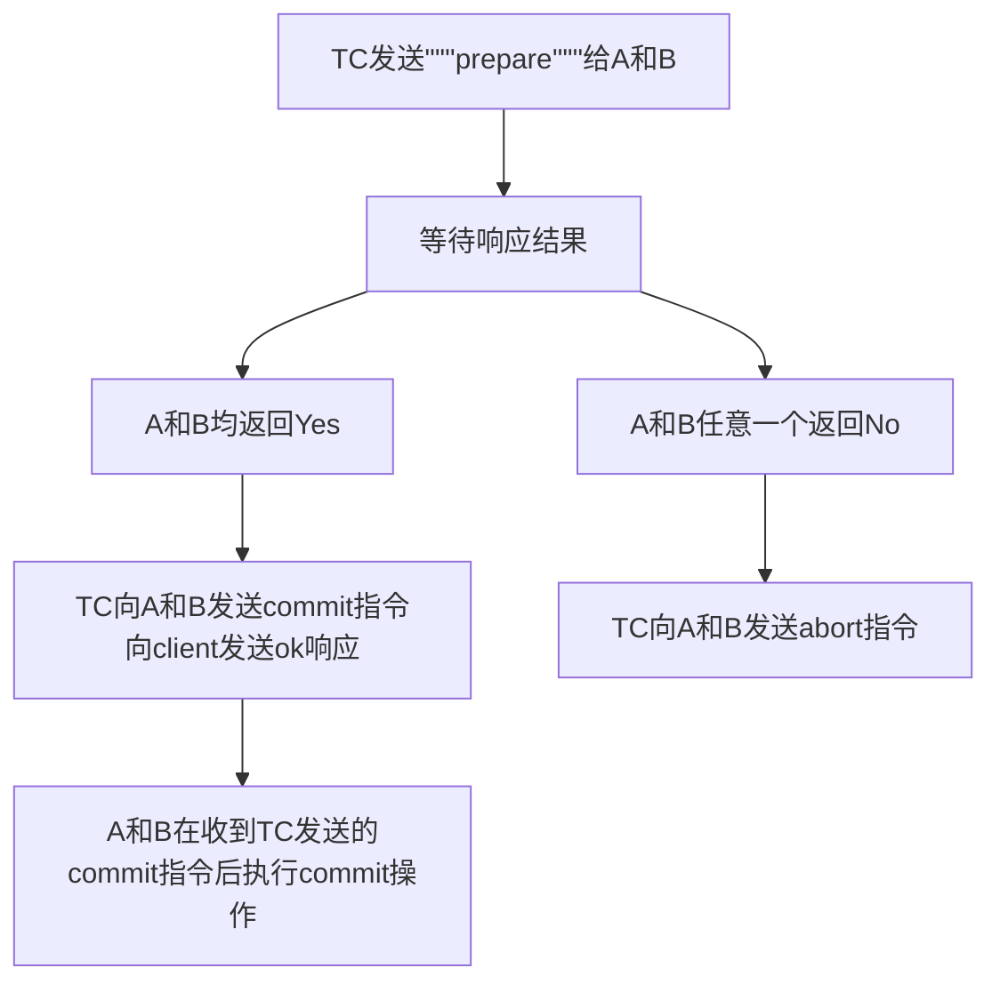
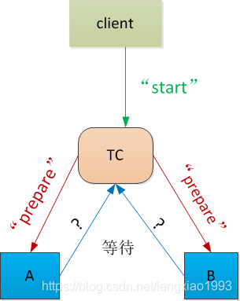
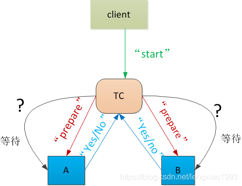

# 二阶段提交

[TOC]

## 明确问题

从一个场景入手， 假设一个人要从 A 银行向 B 银行进行跨行转账 100 元。

此时我们需要对 A 银行数据库中该用户的账户，做金额扣减操作（ - 100）， 同时对 B 银行数据库中该用户的账户做金额增加操作 （ +100）

这两个操作( -100 和 + 100） 我们希望它们是一个事务， 要么同时成功， 要么同时失败 。

此时我们的目标是希望有一个

* 原子性的提交协议 （Atomic Commit Protocol）
  

## 草稿方案

场景难点一：

- A --> B : 你提交我就提交
- B 不理 A
- 然后 ？
- A 和 B 都没有办法继续


先提出一种拍脑门方案， 设置一个事务协调者（ Transaction Coordinator）。

由该协调者分别向 A 银行 ， B银行发送指令， 发送完毕后直接予以返回成功



显然， 上述方案会出现很多问题：

* 问题一： A 银行余额不足
  * A 未提交事务， B 却成功提交

* 问题二： B 银行账户不存在
  * A 提交事务， B 未提交

* 问题三： TC 到 B 中间的网络发生中断

  * A 提交， B 没提交


* 问题四： TC 在给 B 发送指令前宕机
  * A 提交， B 没提交


## 原子提交协议希望实现的2个特性

由上面的场景， 我们可以总结出所有原子提交协议希望实现的2个特性

* 安全性（Safety）

  * 如果任意一方 commit， 所有人必须都 commit

  * 如果任意一方中断，则没有任何一个人进行 commit
* 存活性（Liveness）
  * 没有宕机或失败发生时， A 和 B 都能提交， 则提交
  * 如果发生失败时，最终能达成一个一致性结果（成功/失败）， 予以响应， 不能一直等待


## 正确的二段提交协议（Two-Phase Commit）







上面的流程看似简单， 但是有一个点容易被忽略：

* 当 TC 收到 A 和 B 响应 “Yes” 后， 做出了 “commit” 的决定， 向 A /B 发送指令或， **并不需要再等待 A/B 的响应， 可以直接向 client 返回成功**
* 之所以可以这样做的原因是， 当 A/B 返回 Yes 后， 就代表 A 和 B 都做好了提交准备， 只要 TC 决定要提交，即使 A/B 宕机， 没有收到 TC 的 Commit 指令， 只要 A/B 被修复重启， A 和 B 都必须有能力成功完成提交操作。


## 二阶段提交协议如何满足安全性（Safety）

- 事务协调者 TC，作为一个中心， 统一收集了 A 和 B 是否有意愿（有能力）进行 commit
- 事务协调者 TC 强制保证了， A， B 双方必须都有意愿提交时， 才进行 commit


## 二阶段提交协议如何满足存活性( Liveness)

遗憾的是： 上面描述的协议无法满足存活性。

下面分析一下这个协议在执行过程中可能面临哪些问题

* 问题1： 响应超时
  * 结点正常运行， 但是没有正常收到它所期待的响应， 可能原因如下
    * 其他的结点故障了
    * 网络情况不好， 数据包丢失了或网络干脆中断了
* 问题2： 重启
  * 结点宕机， 重启以后， 如何恢复被中断的操作


## 如何应对超时

首先分析整个协议里面有哪些等待操作？

1. 事务协调者 TC 需要**等待 A 和 B 返回 “yes”/“no”** 才能进行下一步操作




2. A 和 B 需要**等待 TC 发送 “commit”/ “abort” 指令**， 才能进行下一步操作




然后分析等待状态超时的时候， 是否有办法继续协议

* 事务协调者 TC 需要等待 A 和 B 返回 “yes”/“no” 超时：
  * 此时 ， TC 还没有发送过任何 “commit” 指令
  * TC 此时可以安全地发起终止 “abort” 指令， 放弃 commit
      * 上面这种做法， 保证了安全性， 放弃了存活性
      * 因为 A， B 可能都做好了准备进行提交， 只是 “yes” 信息没有成功被 TC 收到， 就导致了整个事务无法提交
      * 这种情况属于本可以提交而未提交， 也就是说 TC 采取了非常保守的方案
* A 和 B 需要**等待 TC 发送 “commit”/ “abort” 指令**超时：

  * 以 B 为例进行考虑（ A 的情形完全对称）

  * 如果 B 之前回复的是 “no” , 那此时， B 可以无需等待 TC 回复就放弃 commit 操作， 因为 TC 即使收到了响应， 也会回复 “abort”, 这个行为是统一的

  * 如果 B 之前回复了 “Yes”,那此时 B 能单方面地直接进行 abort 操作吗？

    * **不行**！ 因为， TC 此时可能已经成功收到了 A， B 返回的 “Yes”, 并且已经向 A 发送了 “Commit”, 然后再向 B 发送 “commit” 前宕机了
    * 如果 B 放弃了 commit 操作， 就会出现 A 执行了 commit, B 未执行 Commit 的情形， 显然违背了安全性（Safety）

  * 那 B 能单方面地直接进行 commit 操作吗？
    *  “**不行**” ！ 因为 A 可能返回给TC 的响应是 “No”

  * 那此时应该怎么办？：
      * 方案一： B 一直等待 TC 的 “commit”/ “abort” 指令
      * 方案二（更好）： B 针对这种情形发起一轮**终止协议操作（Termination Protocol）**


## 超时终止协议

* B 向 A 发送状态查询请求， 询问 A 是否知道事务已经提交

* 如果 B没有收到 A 的响应， B 无法进行后续操作， 只能继续等待

* 如果 B 收到了 A 的响应， 则分如下几种情况：

  * A 回复说 ， 它已经收到了来自 TC 的 “commit”/ “abort” 指令

    * 此时 B 可以执行 “commit”/ “abort”, 应为 TC 发给 B 的指令肯定和 A 一样
  
  * A 回复说， 它还没有向 TC 回复 “yes”/“no”,
    * 此时 B 和 A 都直接执行 abort 操作  
    * 不必担心 TC， 因为 TC 尚未收到 A 的回复， 最终会根据 A 和B 的状态回复 client
  
  * A 回复说， 它向 TC 回复了 “no”
    * 此时 B 和 A 都直接执行 abort 操作
  
  * A回复说， 它向 TC 回复了 “yes”
    * **此时 B 不能进行后续操作**
    * 因为 TC 可能已经收到了 A 和 B 的 “Yes” 响应， 并且决定执行 “commit”, 向 A 和 B 发送了“commit” 指令， 只是没被 A 和 B 收到， 但是 TC 发送 “commit” 之后就会直接向客户端返回了 “ok”
    * TC 也有可能在等待 A 和 B 的响应过程中超时了， 直接进行了 “abort” 决定， 向 A 和 B 发送了 “abort” 指令， 只是没被 A 和 B 收到， 但是 TC 发送 “abort” 之后就会直接向客户端返回了 “fail”


## 如何应对宕机重启

基本原则： 一旦 TC 决定了 commit , 那么任意一个结点都不允许发生回滚

有如下几种情形需要考虑：

- TC 在做出决定后， 立即宕机了， 没有吧 commit 指令成功发送给 A 和 B , 然后被重新启动
- A 和/或 B 在发送 Yes 的过程中， 宕机了， 没有把 " Yes" 成功发送给 TC ， 然后被重新启动

如果所有的结点， 都能知道他们在宕机前的状态是什么， 那就有如下几种解决方案：

- A 或 B 相互发起之前描述的终止协议 **Termination Protocol**, 即相互询问是否知道事务已经交
- A 和 B 也可以向 TC 发起状态查询操作， TC 可能知道事务是否已经提交

如何保证在宕机重启后， 依旧能够记得宕机前的状态：

* 在发送任何信息给其他结点前， 一定要先行将自己要回复的内容写入磁盘， 这样可以保证一旦宕机， 可以知道宕机前的状态。
  * 对于 TC 而言， 在向 A 和 B 发送 “commit” 指令前， 一定要先行将 “commit” 成功记录到磁盘
  * 对于 A/B 而言， 在向 TC 发送 “yes” 之前， 一定要先行将 “yes” 记录成功记录到磁盘

这样重启之后就可以进行如下的操作：

* 对于TC， 重启以后， 如果发现磁盘中没有记录 “commit” , 那就可以直接进行 “abort” 操作
  * 磁盘中没有 “commit” ， 就说明根本没向 A/B 发送过 “commit”, 此时是安全的
* 对于 A 或者 B ， 重启以后， 如果发现磁盘中没有记录 “yes” , 那就可以直接进行 “abort” 操作
  * 磁盘中没有 “yes” , 说明根本没有向 TC 发送过 “yes”, TC 不可能做出 “commit” 操作， 执行abort 是安全的
* 对于 A或者 B， 重启以后， 如果发现磁盘中有 “yes” 记录， 那就可以发起终止协议 “termination protocol”
  * 终止协议有可能陷入继续的等待中
* 如果TC， A， B 都发生了重启操作， 只要当 3 个结点都恢复以后， 就可以向 TC 发起查询， 查看TC 的磁盘中是否存在 “commit” 记录， 如果存在， 则均可进行 “commit” 操作


## 二阶段提交实现的工程化难点

### 准备阶段到底干了什么

回顾之前的内容，可以发现， 二阶段提交协议（Two-Phase Commit）的核心是

* 引入了一个事务协调者（TC）
* 在真正的提交操作前， 增加了一个准备阶段， 收集业务结点是否有能力进行提交

部分程序员可能会对其工程实现的一个关键点产生误解：

* 准备阶段就是开启一个事务， 执行所有的业务代码， 都不报错， 不执行事务的 commit 操作， 然后向 TC 回复 “Yes”, 表示我已准备好提交
  

**这种做法并不满足二阶段提交协议对于准备操作的要求**:

* 二阶段提交协议中， 业务结点回复 “Yes” ， 代表它做好了提交操作的所有准备， 只要结点回复了 “Yes”, 即使突然发生宕机， 只要结点重新启动， 收到了 TC 发送的 commit 指令， 必须依旧能正确提交
* 普通数据库如果在在一个事务中间发生了宕机（比如数据库所在机器直接停电）， 重启以后， 数据库的默认行为是对处于中间状态的事务进行回滚操作， 并不具备继续等待并接受 commit 指令的能力

以之前提到的转账操作为例， 如果 A 银行需要对转账客户的账户执行 -100 元操作， 当它向 TC 回复了 “Yes” 前， 应该完成以下操作：

* 确定账户上有 100 待扣减， 将这100 元冻结， 其他的操作无法解冻， 转移这100元。
* 留下必要的持久化记录， 确保即使宕机重启， 收到 “abort” 指令也有能力回滚到100 元被冻结前的状态
* 留下必要的持久化记录， 确保即使宕机重启， 收到 “commit” 指令也有能力正确提交， 完成 -100 元操作
* 留下必要的持久化记录， 标识自己已经完成了准备阶段的所有操作， 要向 TC 回复 “Yes” 指令

只有以上这些操作都成功完成以后， 银行 A 才能尝试向 TC 发送 “Yes” 指令，否则就有违二阶段提交协议

### 事务协调者是第三方吗

二阶段提交中， 除了准备阶段， 另一个显眼的角色就是事务协调者（ Transaction Coordinator）。

此时就会有部分同学产生困惑， 事务协调者是否一定得是一个独立的机器，处于独立的结点。

答案： **并不是!**

从准备阶段的要求就可以看出。 二阶段提交协议的核心， 是描述了在每一步操作前， 每一种角色应该达到什么状态， 具备什么能力。 具体在工程实现中， 这几种角色分布在几个结点， 以什么方式去实现， 都是可以的。

以前文所举的银行转账操作为例。

客户端 client 发起一个转账操作请求给 TC， 这个 TC 完全可以就属于银行 A。 只要银行 A 实现的 TC 在银行 A 数据库发起 -100 元的操作前，依旧先按照协议要求;

* 模拟 prepare 阶段， 进行持久化记录
* 做好 -100 元随时提交或回退的准备

即可以根据银行 B 的准备阶段应答结果， 进行后续的操作。


## 二阶段提交协议（Two-Phase Commit）的总结

二阶段提交所说的二阶段分别指： Prepare , Commit 两个阶段

二阶段提交满足如下性质：

* 安全性： 所有的结点最终会达成一致的决定
* 安全性： 只有当所有人都说了 “yes”, 才会执行提交
* 存活性： 如果没有宕机和信息丢失， 提交肯定可以完成
* 存活性： 如果发生宕机和信息丢失， 只要最终修复， 并且重启， 等待足够长的时间， 最终一定可以达成某项一致的结果（abort 或者 commit）
  

可能有同学会有疑问， 那如果宕机不能被修复， 那些处于中间状态的记录怎么办：

1985 年 Fischer, Lynch, Paterson 提出了定理：

```
no distributed asynchronous protocol can correctly agree in presence of crash-failures
```

翻译一下就是

```
在出现宕机时（最终没有修复并重启）， 不存在一种分布式的异步协议可以正确地达成一致结果（同时提供安全性和存活性）。
```
