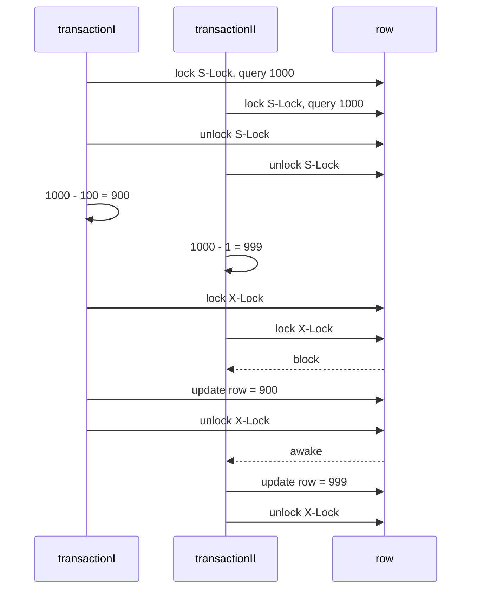

# 高性能MySQL 笔记

## 表

### 列

#### 过多的列

由于MySQL的存储层与通信层之间使用的缓冲格式是列缓冲的, 过多的列转行导致开销增大.

### 范式

+ 1NF: 列具有原子性,  不可拆分.
+ 2NF: 在满足第一范式（1NF）的基础上, 每一个非码属性（不在主键中的列）都必须**完全函数依赖于** *候选码*. 若某些非主属性不依赖于候选码, 那么会不符合2NF.
+ 3NF: 在满足第二范式（2NF）的基础上, 每个非主属性不依赖于其它非主属性, 即在2NF基础上，消除非码属性对候选码的传递函数依赖.(即所有非主属性对主属性直接依赖, 不能传递地依赖.)
+ BCNF: 非主属性不能对主属性部分依赖.


### 数据类型

#### VARCHAR vs. CHAR

+ varchar 保留尾部空格, char不保留.
+ varchar 适用于字符串长度方差大的.
+ varchar 省空间但是update成本高.


#### BLOB & TEXT

+ 都是存储指针, 需要二次访问.
+ 可以做索引, 但是必须给出前缀长度.

## 事务

### A.C.I.D.

- Atomicity（原子性）：一个事务（transaction）中的所有操作，或者全部完成，或者全部不完成，不会结束在中间某个环节。事务在执行过程中发生错误，会被回滚（Rollback）到事务开始前的状态，就像这个事务从来没有执行过一样。即，事务不可分割、不可约简。
- Consistency（一致性）：在事务开始之前和事务结束以后，数据库的完整性没有被破坏。这表示写入的资料必须完全符合所有的预设约束、触发器、级联回滚等。
- Isolation（隔离性）：数据库允许多个并发事务同时对其数据进行读写和修改的能力，隔离性可以防止多个事务并发执行时由于交叉执行而导致数据的不一致。事务隔离分为不同级别，包括未提交读（Read uncommitted）、提交读（read committed）、可重复读（repeatable read）和串行化（Serializable）。
- Durability（持久性）：事务处理结束后，对数据的修改就是永久的，即便系统故障也不会丢失。

| 出现的问题 | 原因                                                         | 解决                                     |
| ---------- | ------------------------------------------------------------ | ---------------------------------------- |
| 脏读       | 读取了其他事务未提交的数据, 导致数据错误.                    | 改为提交读. —— 只能读取事务提交后的数据. |
| 不可重复读 | 一个对同一数据的两次查询之间, 另一个事务做出了修改, 导致前后不一致. | 改为可重复读. —— 使用 X, S锁.            |
| 幻读       | 查询结果为多个记录的时候, 前后两次这样的查询之间, 插入了新的记录, 导致前后结果不一致 | 串行化 或 Next-Key Lock                  |
| 更新丢失   | 两个事务同时对同一个数据进行更新操作, 其中在read-and-write阻塞, 尽管加S, X锁仍然导致错误. | 串行化.                                  |

> 更新丢失出现, 有可能并非事务隔离能避免的.
>
> 例如现在两个程序端, 同时对同一个人取款. 初始1000, 事务一取 100块, 事务二取 1 块.
>
> 共计取了101, 应该为899元, 结果却为999元.
>
> 串行化可以解决此类问题.




#### 事务分类

+ 扁平事务

+ 带保存点的扁平事务

+ 链事务

+ 嵌套事务

####  事务陷阱

+ 自动回滚 —— 自动回滚不会抛出异常, 无法知道异常. (SQL Server 会抛出异常, 这个是MySQL特有的缺点)
+ 自动提交.
+ 在循环中提交 —— 意外导致在未知位置终止, 无法还原.

### 锁

#### 行锁

##### 共享锁, 独占锁

+ 允许多个事务读同一行.
+ 当事务对同一行进行写操作, 将阻塞其他所有事务的读、写操作.


#### 行锁算法
##### Record Lock

单一行锁.

##### Gap Lock

锁定一个区间, 但是不包括该记录本身.

##### Next-Key Lock

锁定该记录本身, 并且锁定包含它的一个范围.

#### 粒度锁

##### 意向锁 :  树状锁

锁的结构呈树状, 粗粒度锁拥有几个粒度细的锁.

叶子的粒度细, 父节点的粒度粗.


## 索引

### 索引的相关理论

#### 最左前缀匹配

MySQL引擎采用最左前缀匹配的机制, 可以高效从左匹配.

所以最左端是模糊查询的时候, 最左前缀匹配失效, 导致性能降低.

#### 可选择性

可选择性的意思是, 针对某一字段查询出的结果, 对于这个的分区度.(这一字段的重复程度)

> 例如, 性别的区分度就很低: 根据某个性别查询出的结果, 性别的区分度及其低. 
>
> 再如, 年龄、城市的区分度稍稍高于性别的区分度.
>
> 最高的区分度莫过于ID之类的字段. 其是唯一的, 所以它的可选择性及高.

解决可选择性低的方法是, 将几个可选择性低的字段使用多列索引组合起来, 让其可区分度上升.

#### 聚集索引 vs. 辅助索引

+ 聚集索引: 也称主码索引, 使用主码建立的索引, 直接指向数据.
+ 辅助索引: 非主码索引, 该索引指向主码. 先用该索引定位主码, 再用主码定位数据.

### 聚簇索引

将某一列相同相近的记录排在一起, 进行索引.

> 其提高了I/O密集型的性能, 相关数据保存在一起.

#### 聚簇 vs 可选择性 —— UUID vs. 自增ID的选择及UUID的优化

+ UUID应该使用UNHEX存储在Binary(16)中, 而不是用字符串存储.
+ UUID的引入, 导致了索引的随机性大大增加, 索引占用空间变大.
+ 因为UUID是随机的,  每一页都是随机填充的, 导致页内碎片变多. 而且因为写入是乱序的, 导致频繁的页分裂.
+ UUID是随机的, 导致大量的随机I/O, 性能大幅下降.
+ 自增ID会有自增锁, 频繁的锁也会导致阻塞. 
+ 自增PK会成为热点数据, 并发插入导致**间隙竞争**可以考虑修改``innodb_autoinc_lock_mode`` 进行优化.

>  折中方案:
>
> 使用前缀顺序+后缀随机的组合式ID可以达到这两种极端的综合.

### 多列索引

为了解决可选择性过低的问题, 多个选择性低的字段, 可用多列索引组合起来, 提高可选择性, 这就是多列索引.

但是选择性高的字段组合起来, 会增加负担.

> 例如有一些待查询的列: <性别,  年龄, 城市>
>
> + 性别的可选择性最低, 因为查询出的人性别无非就几种, 这列的查询结果重复度极高.
> + 其次, 年龄一般在0~99之间集中分布,  重复读虽然低于性别, 但是几十万的数据集中分布在0~99这个区间, 重复度也不低.
> + 同理, 城市的区分度高于前两者, 但是可选择性也是一般.
>
> 此时, 可以建立一个多列索引, 将这三个可选择性低的列绑成一个多列索引, 可以大大提高可选择性.

### 覆盖索引\*\*\*

> 如果一个索引覆盖了查询字段的所有值, 那么称其为覆盖索引.

优点:

+ 索引条目少.
+ 索引按照列值存储, 使用顺序的磁盘I/O; 少次的顺序I/O比多次的随机I/O性能好.

**索引失效情况**

+ 索引没有覆盖到查询列. —— **使用延迟查询解决.**
+ MySQL5.5 之后可以使用最左前缀匹配的Like查询, 但是非最左前缀匹配的模糊查询将使得索引失效.
+ ORDER BY, GROUP BY所用的列未索引覆盖, 导致无法索引排序.

### 索引排序\*\*\*

> 利用索引对数据进行排序.

针对 ORDER BY和GROUP BY

+ 只有当查询的列顺序和排序的列顺序相同, 且排序方向相同(都是升序或都是降序), MySQL才会对其进行索引排序.
+ 关联多表的ORDER BY、GROUP BY引用的字段必须全部为首张表, 才会触发索引排序.
+ 必须满足最左前缀匹配.
+ 范围查询中的列与ORDER BY、GROUP BY中的列要一致, 才能出发索引排序.

### 冗余索引

> 若有索引$(A,B)$ 之后又出现了 索引$(A)$ , 则 $(A)$ 是$(A,B)$的索引.
>
> 但$(A)$不是$(B,A)$ 的索引.

因为索引多, 虽然查询快, 但是插入慢(需要维护索引的成本变高). 冗余、重复的索引会降低性能.

### 索引类型

> EXPLAIN中的extra字段可显示. 指检索数据的方式.

| Extra           | 意思                       | 可能出现的情况                                               |
| --------------- | -------------------------- | ------------------------------------------------------------ |
| using index     | 使用索引                   | 覆盖索引, 高效.                                              |
| using where     | 存储引擎收到记录后进行过滤 | 索引未覆盖, 或部分覆盖.                                      |
| using condition | 使用条件                   | 查询会先条件过滤索引，过滤完索引后找到所有符合索引条件的数据行，<br>随后用 WHERE 子句中的其他条件去过滤这些数据行. |
| using filesort  | 使用文件排序               | 无法利用索引完成的排序操作称为“文件排序”.                    |
| using temporary | 使用临时表                 | 需要使用临时表来存储结果集，常见于排序和分组查询.            |


### 三星索引

| 星级 | 定义                                                 | 原理                             | 实现                                      |
| ---- | ---------------------------------------------------- | -------------------------------- | ----------------------------------------- |
| 🌟    | 这个索引与一个查询相关的索引行是相邻的, 或者是相近的 | 它最小化了必须扫描的索引片的宽度 | 把 WHERE 后的等值条件列作为索引最开头的列 |
| 🌟🌟   | 索引行的顺序与查询语句的需求一致                     | 排除了排序操作                   | ORDER BY的列都在索引中, 且与查询顺序一致  |
| 🌟🌟🌟  | 如果索引行中包含查询语句中的所有列                   | 覆盖索引                         | 实现覆盖索引                              |


## 查询

> 查询变慢的原因包括但不限于:
>
> + 返回了过多的数据.
> + 返回了不需要的列.

### 扫描类型

> 使用EXPLAIN语句可以查看该查询的扫描类型, 在type字段. 指检索数据的集合.
>
> 性能高低:
>
> 常数引用  > 唯一索引查询 > 范围扫描 > 索引扫描 > 全表扫描

扫描类型

|     类型     |         名称         | 成因                                                         |
| :----------: | :------------------: | ------------------------------------------------------------ |
|     ALL      |       全表扫描       | 查询扫描了全部整个表, 性能最低                               |
|    index     |      索引全扫描      | 查询扫描了整个索引                                           |
|    range     |     索引范围扫描     | 是范围查询                                                   |
|     ref      |    非唯一索引扫描    | 非唯一索引或者使用了最左前缀匹配                             |
|    eq_ref    |     唯一索引扫描     | 一般出现在多表连接时使用primary key或者unique index作为关联条件 |
| const,system | 单表最多有一个匹配行 | 出现在根据主键primary key, 或者唯一索引 unique index 进行的查询 |
|     NULL     |   不用扫描表或索引   | 不用访问表或者索引，直接就能够得到结果                       |


### 简单查询 vs. 复杂查询

如果条件允许, 应该使用多个简单查询替代一个复杂查询. 

这样的查询结果很高效, 而且还能将查询结果缓存.

### 关联查询

MySQL的关联查询是一个左长臂二叉树, 而不是AVL树. 大量的联合查询导致左子树呈现出线性的特征, 导致效率低下.

需要避免过多的多表查询, 或者手动优化JOIN的方式, 使查询树的高度变低.


​                   JOIN

​                /          \

​            JOIN     table4

​          /        \

​     JOIN     table3

   /        \

table1  table2


### 延迟关联

若在查询中有索引无法覆盖的列, 应该拆分出来成为一个子查询, 使用例如left outer/inner join进行连接后查询.

> 例如:
>
> ```mysql
> SELECT id, description from tableA order by title limit 50,5; -- title没有索引覆盖
> -- 化为
> SELECT id, decription from tableA inner join (SELECT id from tableA order by title) as tmp USING(id); -- 缩小非索引覆盖的范围. 子查询只查pk.
> 
> SELECT id, cu_id, name, info, biz_type, gmt_create, gmt_modified,start_time, end_time, market_type, back_leaf_category,item_status,picuture_url FROM relation where biz_type ='0' AND end_time >='2014-05-29' ORDER BY id asc LIMIT 149420 ,20;
> 
> SELECT a.* FROM relation a, (select id from relation where biz_type ='0' AND end_time >='2014-05-29' ORDER BY id asc LIMIT 149420 ,20 ) b where using(id)
> ```
> 
> 

### 可选择性 & WHERE的优化

+ 可选择性高的列放在前查询, 查询结果基数降低, 可以提高性能.

+ 所以, WHERE **精确值查询**{可选择性高, ..., 可选择性低}  + **范围查询**{可选择性高(例如IN语句), >< !=,..., 可选择性低(区分度低的列)}

+ 索引未覆盖的列应该进行拆分, 进行延迟关联.

### 范围查询

避免多个范围查询: MySQL无法同时使用两个范围查询的索引.

使用IN()替代范围查询, 会提高效率.

### IN() & EXIST()

+ EXITS的可以使得查询提前结束, 从而提高效率.
+ 使用IN效率高于比较符号. 但是IN的代价很高, IN()中的值最好不要过多. 因为IN()会对其内部的值进行一个全排列. 例如IN()中写了4个值, 那么其就要对这4个值做一个全排列$4! = 24$ , 可以看出, 这个代价是连乘积复杂度, IN()也并非银弹.
+ OUTER JOIN的效率 > EXITS的效率 > INNER JOIN的效率.

### 子查询

+ 由于MySQL引擎的原因, 子查询效果很差, 使用left outer join的方式替代, 可以提升性能.
+ IN()中的子查询效率比EXIST()的子查询低很多, 最好别用IN子查询, 应该优先使用EXIST子查询. (MySQL查询引擎缺陷导致的问题)

### UNION优化

+ order by / limit语句写在每个union的子查询中, 而不是最后再order by / limit.

### LIMIT优化

+ 延迟关联
+ ~~使用between and 语句代替比较符号.~~

## 分区

> 分区也并非银弹.

+ 所有对分区的操作, 第一步都会锁住分区的底层表, 然后判定操作范围, 解锁操作范围之外的分区, 再做相应的操作,.
+ B-Tree索引将失效.
+ 索引维护极高.

