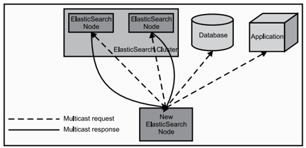
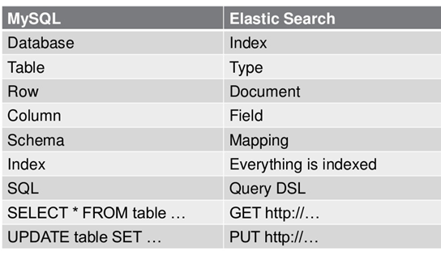
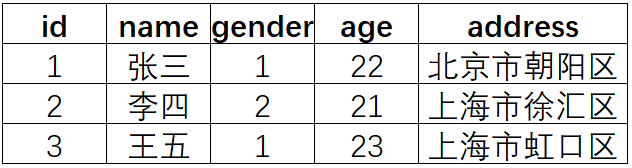
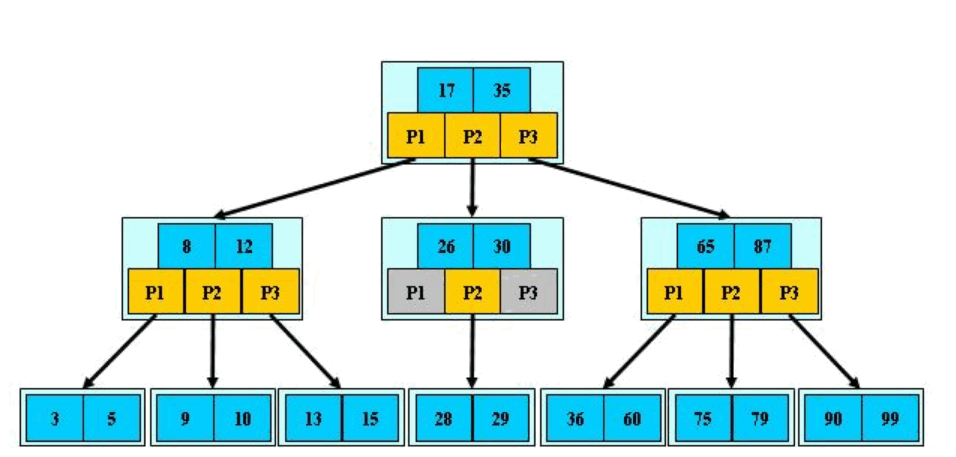
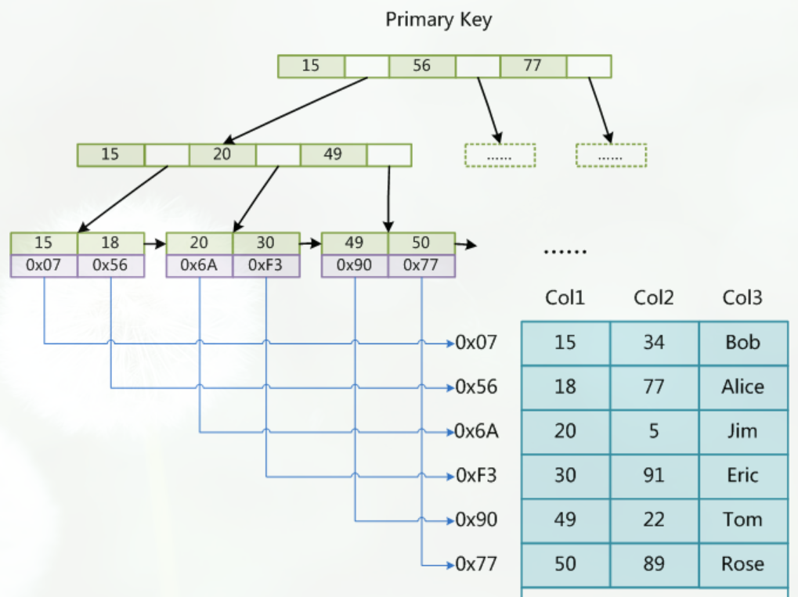
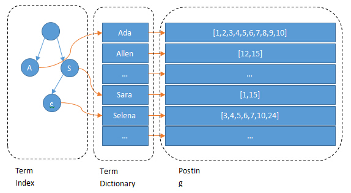

# elasticsearch

[TOC]

## ES基础

### 1.ES定义
ES = elaticsearch简写， Elasticsearch是**一个开源的高扩展的分布式全文检索引擎**，它可以近乎实时的存储、检索数据；本身扩展性很好，可以扩展到上百台服务器，处理PB级别的数据。 
Elasticsearch也使用Java开发并使用Lucene作为其核心来实现所有索引和搜索的功能，但是它的目的是通过简单的RESTful API来隐藏Lucene的复杂性，从而让全文搜索变得简单。

### 2.Lucene与ES关系
1）Lucene只是一个库。想要使用它，你必须使用Java来作为开发语言并将其直接集成到你的应用中，更糟糕的是，Lucene非常复杂，你需要深入了解检索的相关知识来理解它是如何工作的。

2）Elasticsearch也使用Java开发并使用Lucene作为其核心来实现所有索引和搜索的功能，但是它的目的是通过简单的RESTful API来隐藏Lucene的复杂性，从而让全文搜索变得简单。

### 3.ES主要解决问题
1）检索相关数据； 

2）返回统计结果； 

3）速度要快。

### 4.ES工作原理
当ElasticSearch的节点启动后，它会利用多播(multicast)(或者单播，如果用户更改了配置)寻找集群中的其它节点，并与之建立连接。这个过程如下图所示： 

### 5.ES核心概念

#### 1）Cluster：集群

ES可以作为一个独立的单个搜索服务器。不过，为了处理大型数据集，实现容错和高可用性，ES可以运行在许多互相合作的服务器上。这些服务器的集合称为集群。

#### 2）Node：节点

形成集群的每个服务器称为节点。

#### 3）Shard：分片

当有大量的文档时，由于内存的限制、磁盘处理能力不足、无法足够快的响应客户端的请求等，一个节点可能不够。这种情况下，数据可以分为较小的分片。每个分片放到不同的服务器上。 

当你查询的索引分布在多个分片上时，ES会把查询发送给每个相关的分片，并将结果组合在一起，而应用程序并不知道分片的存在。即：这个过程对用户来说是透明的。

#### 4）Replica：副本
为提高查询吞吐量或实现高可用性，可以使用分片副本。 

副本是一个分片的精确复制，每个分片可以有零个或多个副本。ES中可以有许多相同的分片，其中之一被选择更改索引操作，这种特殊的分片称为主分片。 

每个shard的replica一般情况下会分布在不同的主机中。

当主分片丢失时，如：该分片所在的数据不可用时，集群将副本提升为新的主分片。

#### 5）全文检索

全文检索就是对一篇文章进行索引，可以根据关键字搜索，类似于mysql里的like语句。 

全文索引就是把内容根据词的意义进行分词，然后分别创建索引，例如”你们的激情是因为什么事情来的” 可能会被分词成：“你们“，”激情“，“什么事情“，”来“ 等token，这样当你搜索“你们” 或者 “激情” 都会把这句搜出来。

### 6.ES数据架构的主要概念（与关系数据库Mysql对比）

* （1）关系型数据库中的数据库（DataBase），等价于ES中的索引（Index），**Index是ES存储数据的基本单位**。

* （2）一个数据库下面有N张表（Table），等价于1个索引Index下面有N多类型（Type）。

* （3）一个数据库表（Table）下的数据由多行（ROW）多列（column，属性）组成，等价于1个Type由多个文档（Document）和多Field组成。 

* （4）在一个关系型数据库里面，schema定义了表、每个表的字段，还有表和字段之间的关系。 与之对应的，在ES中：Mapping定义索引下的Type的字段处理规则，即索引如何建立、索引类型、是否保存原始索引JSON文档、是否压缩原始JSON文档、是否需要分词处理、如何进行分词处理等。 

* （5）在数据库中的增insert、删delete、改update、查search操作等价于ES中的增PUT/POST、删Delete、改Update、查GET。

### 7.ELK是什么

ELK=elasticsearch+Logstash+kibana 

elasticsearch：后台分布式存储以及全文检索 

logstash: 日志加工、“搬运工” 

kibana：数据可视化展示。 

ELK架构为数据分布式存储、可视化查询和日志解析创建了一个功能强大的管理链。 三者相互配合，取长补短，共同完成分布式大数据处理工作。

### 8.ES特点和优势

1）分布式实时文件存储，可将每一个字段存入索引，使其可以被检索到。 

2）实时分析的分布式搜索引擎。 
分布式：索引分拆成多个分片，每个分片可有零个或多个副本。集群中的每个数据节点都可承载一个或多个分片，并且协调和处理各种操作； 
负载再平衡和路由在大多数情况下自动完成。 

3）可以扩展到上百台服务器，处理PB级别的结构化或非结构化数据。也可以运行在单台PC上（已测试） 

4）支持插件机制，分词插件、同步插件、Hadoop插件、可视化插件等。

## elasticsearch分布式架构原理

### 1.倒排索引

倒排索引（Inverted Index）也叫反向索引，有反向索引必有正向索引。通俗地来讲，正向索引是通过key找value，反向索引则是通过value找key。

其实就是直接PUT一个JSON的对象，这个对象有多个字段，在插入这些数据到索引的同时，Elasticsearch还为这些字段建立索引——倒排索引，因为Elasticsearch最核心功能是搜索。

那么，倒排索引是个什么样子呢？

首先，来搞清楚几个概念，为此，举个例子：

假设有个user索引，它有四个字段：分别是name，gender，age，address。画出来的话，大概是下面这个样子，跟关系型数据库一样

**Term（单词）**：一段文本经过分析器分析以后就会输出一串单词，这一个一个的就叫做Term（直译为：单词）

**Term Dictionary（单词字典）**：顾名思义，它里面维护的是Term，可以理解为Term的集合

**Term Index（单词索引）**：为了更快的找到某个单词，我们为单词建立索引

**Posting List（倒排列表）**：倒排列表记录了出现过某个单词的所有文档的文档列表及单词在该文档中出现的位置信息，每条记录称为一个倒排项(Posting)。根据倒排列表，即可获知哪些文档包含某个单词。（PS：实际的倒排列表中并不只是存了文档ID这么简单，还有一些其它的信息，比如：词频（Term出现的次数）、偏移量（offset）等，可以想象成是Python中的元组，或者Java中的对象）

（PS：如果类比现代汉语词典的话，那么Term就相当于词语，Term Dictionary相当于汉语词典本身，Term Index相当于词典的目录索引）

我们知道，每个文档都有一个ID，如果插入的时候没有指定的话，Elasticsearch会自动生成一个，因此ID字段就不多说了

上面的例子，Elasticsearch建立的索引大致如下：

name字段：

age字段：

gender字段：

address字段：

Elasticsearch分别为每个字段都建立了一个倒排索引。比如，在上面“张三”、“北京市”、22 这些都是Term，而[1，3]就是Posting List。Posting list就是一个数组，存储了所有符合某个Term的文档ID。

只要知道文档ID，就能快速找到文档。可是，要怎样通过我们给定的关键词快速找到这个Term呢？

当然是建索引了，为Terms建立索引，最好的就是B-Tree索引（PS：MySQL就是B树索引最好的例子）。

首先，让我们来回忆一下MyISAM存储引擎中的索引是什么样的：

我们查找Term的过程跟在MyISAM中记录ID的过程大致是一样的

MyISAM中，索引和数据是分开，通过索引可以找到记录的地址，进而可以找到这条记录

在倒排索引中，通过Term索引可以找到Term在Term Dictionary中的位置，进而找到Posting List，有了倒排列表就可以根据ID找到文档了

（PS：可以这样理解，类比MyISAM的话，Term Index相当于索引文件，Term Dictionary相当于数据文件）

（PS：其实，前面我们分了三步，我们可以把Term Index和Term Dictionary看成一步，就是找Term。因此，可以这样理解倒排索引：通过单词找到对应的倒排列表，根据倒排列表中的倒排项进而可以找到文档记录）

为了更进一步理解，下面从网上摘了两张图来具现化这一过程：

