# hadoop入门

## 一、hadoop的核心

1.HDFS: Hadoop Distributed File System  分布式文件系统

2.YARN: Yet Another Resource Negotiator   资源管理调度系统

3.Mapreduce：分布式运算框架

## 二、HDFS的架构

主从结构

* 主节点， namenode

* 从节点，有很多个: datanode

namenode负责：

* 接收用户操作请求

* 维护文件系统的目录结构

* 管理文件与block之间关系，block与datanode之间关系

datanode负责：

* 存储文件

* 文件被分成block存储在磁盘上

* 为保证数据安全，文件会有多个副本

## 三、NameNode

### 1.简介

namenode是整个文件系统的管理节点。他维护着整个文件系统的文件目录树，文件/目录的元信息和每个文件对应的数据块列表。接收用户的操作请求。

文件包括：

fsimage:元数据镜像文件。存储某一时段NameNode内存元数据信息。

edits:操作日志文件。

fstime:保存最近一次checkpoint的时间。

### 2.NameNode的工作特点

NameNode始终在内存中保存metedata，用于处理“读请求”，到有“写请求”到来时，NameNode首先会写editlog到磁盘，即向edits文件中写日志，成功返回后，才会修改内存，并且向客户端返回。

Hadoop会维护一个fsimage文件，也就是NameNode中metedata的镜像，但是fsimage不会随时与NameNode内存中的metedata保持一致，而是每隔一段时间通过合并edits文件来更新内容。Secondary NameNode就是用来合并fsimage和edits文件来更新NameNode的metedata的。


### 3.什么时候checkpoint

fs.checkpoint.period 指定两次checkpoint的最大时间间隔，默认3600秒。 

fs.checkpoint.size    规定edits文件的最大值，一旦超过这个值则强制checkpoint，不管是否到达最大时间间隔。默认大小是64M。


## 四、SecondaryNameNode
### 1.简介
HA的一个解决方案。但不支持热备。配置即可。

执行过程：从NameNode上下载元数据信息（fsimage,edits），然后把二者合并，生成新的fsimage，在本地保存，并将其推送到NameNode，替换旧的fsimage.

默认在安装在NameNode节点上，但这样不安全！

### 2.工作流程

（1）secondary通知namenode切换edits文件；

（2）secondary从namenode获得fsimage和edits(通过http)；

（3）secondary将fsimage载入内存，然后开始合并edits；

（4）secondary将新的fsimage发回给namenode；

（5）namenode用新的fsimage替换旧的fsimage；

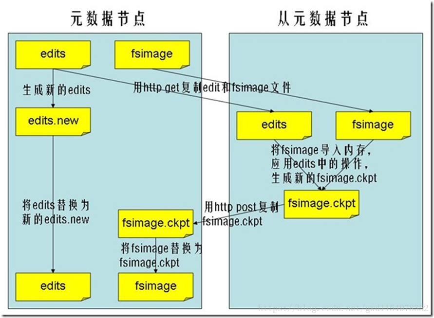

## 五、DataNode

提供真实文件数据的存储服务。

文件块（block）：最基本的存储单位。对于文件内容而言，一个文件的长度大小是size，那么从文件的0偏移开始，按照固定的大小，顺序对文件进行划分并编号，划分好的每一个块称一个Block。HDFS默认Block大小是128MB，以一个256MB文件，共有256/128=2个Block.

dfs.block.size

不同于普通文件系统的是，HDFS中，如果一个文件小于一个数据块的大小，并不占用整个数据块存储空间;

Replication:多复本。默认是三个。


## 六、hadoop里的RPC

### Remote Procedure Call

* RPC——远程过程调用协议，它是一种通过网络从远程计算机程序上请求服务，而不需要了解底层网络技术的协议。RPC协议假定某些传输协议的存在，如TCP或UDP，为通信程序之间携带信息数据。在OSI网络通信模型中，RPC跨越了传输层和应用层。RPC使得开发包括网络分布式多程序在内的应用程序更加容易。

* RPC采用客户机/服务器模式。请求程序就是一个客户机，而服务提供程序就是一个服务器。首先，客户机调用进程发送一个有进程参数的调用信息到服务进程，然后等待应答信息。在服务器端，进程保持睡眠状态直到调用信息的到达为止。当一个调用信息到达，服务器获得进程参数，计算结果，发送答复信息，然后等待下一个调用信息，最后，客户端调用进程接收答复信息，获得进程结果，然后调用执行继续进行。

* hadoop的整个体系结构就是构建在RPC之上的(见org.apache.hadoop.ipc)

## 七、HDFS

### （1）读过程

1. 初始化FileSystem，然后客户端(client)用FileSystem的open()函数打开文件

2. FileSystem用RPC调用元数据节点，得到文件的数据块信息，对于每一个数据块，元数据节点返回保存数据块的数据节点的地址。

3. FileSystem返回FSDataInputStream给客户端，用来读取数据，客户端调用stream的read()函数开始读取数据。

4. DFSInputStream连接保存此文件第一个数据块的最近的数据节点，data从数据节点读到客户端(client)

5. 当此数据块读取完毕时，DFSInputStream关闭和此数据节点的连接，然后连接此文件下一个数据块的最近的数据节点。

6. 当客户端读取完毕数据的时候，调用FSDataInputStream的close函数。

7. 在读取数据的过程中，如果客户端在与数据节点通信出现错误，则尝试连接包含此数据块的下一个数据节点。

8. 失败的数据节点将被记录，以后不再连接。

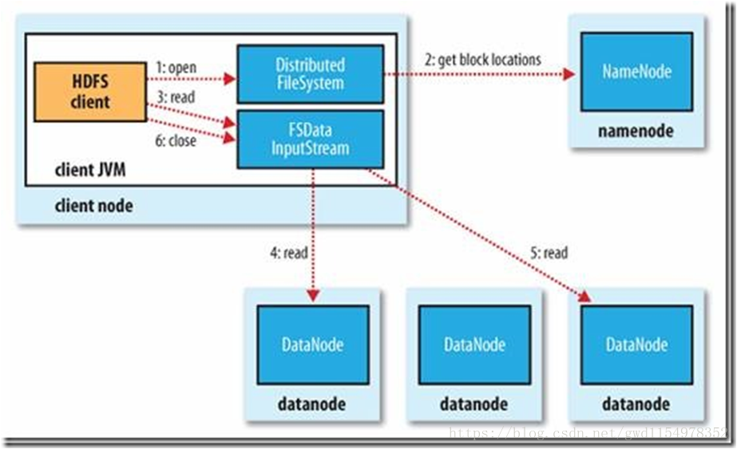


### （2）写过程

1. 初始化FileSystem，客户端调用create()来创建文件

2. FileSystem用RPC调用元数据节点，在文件系统的命名空间中创建一个新的文件，元数据节点首先确定文件原来不存在，并且客户端有创建文件的权限，然后创建新文件。

3. FileSystem返回DFSOutputStream，客户端用于写数据，客户端开始写入数据。

4. DFSOutputStream将数据分成块，写入data queue。data queue由Data Streamer读取，并通知元数据节点分配数据节点，用来存储数据块(每块默认复制3块)。分配的数据节点放在一个pipeline里。Data Streamer将数据块写入pipeline中的第一个数据节点。第一个数据节点将数据块发送给第二个数据节点。第二个数据节点将数据发送给第三个数据节点。

5. DFSOutputStream为发出去的数据块保存了ack queue，等待pipeline中的数据节点告知数据已经写入成功。

6. 当客户端结束写入数据，则调用stream的close函数。此操作将所有的数据块写入pipeline中的数据节点，并等待ack queue返回成功。最后通知元数据节点写入完毕。

7. 如果数据节点在写入的过程中失败，关闭pipeline，将ack queue中的数据块放入data queue的开始，当前的数据块在已经写入的数据节点中被元数据节点赋予新的标示，则错误节点重启后能够察觉其数据块是过时的，会被删除。失败的数据节点从pipeline中移除，另外的数据块则写入pipeline中的另外两个数据节点。元数据节点则被通知此数据块是复制块数不足，将来会再创建第三份备份。

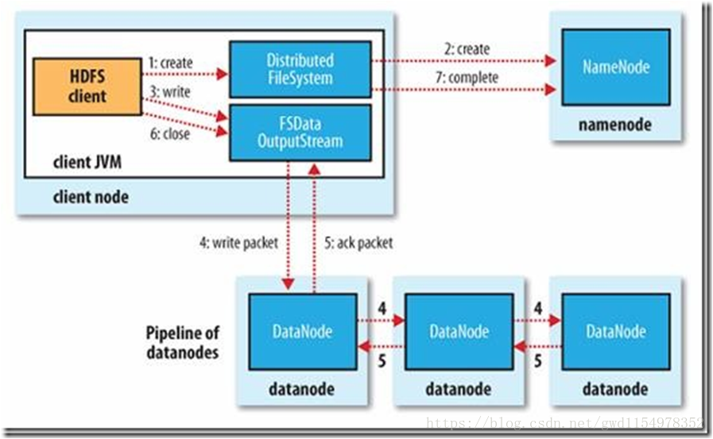


## 八、MapReduce

### MapReduce概述

* MapReduce是一种分布式计算模型，由Google提出，主要用于搜索领域，解决海量数据的计算问题。
* MR由两个阶段组成：Map和Reduce，用户只需要实现map()和reduce()两个函数，即可实现分布式计算，非常简单。
* 这两个函数的形参是key、value对，表示函数的输入信息。


### MapReduce原理

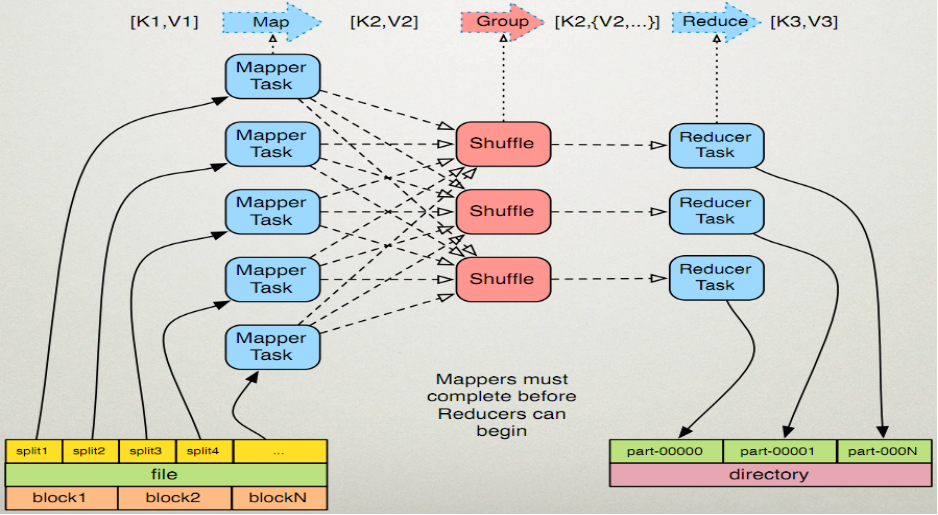

### MapReduce执行步骤

####  map任务处理
1. 读取输入文件内容，解析成key、value对。对输入文件的每一行，解析成key、value对。每一个键值对调用一次map函数。
2. 写自己的逻辑，对输入的key、value处理，转换成新的key、value输出。
3. 对输出的key、value进行分区。
4. 对不同分区的数据，按照key进行排序、分组。相同key的value放到一个集合中。
5. (可选)分组后的数据进行归约。

#### reduce任务处理
1. 对多个map任务的输出，按照不同的分区，通过网络copy到不同的reduce节点。
2. 对多个map任务的输出进行合并、排序。写reduce函数自己的逻辑，对输入的key、value处理，转换成新的key、value输出。
3. 把reduce的输出保存到文件中。

### WordCountApp的驱动代码
```
public static void main(String[] args) throws Exception {
    Configuration conf = new Configuration();    //加载配置文件
    Job job = new Job(conf);    //创建一个job，供JobTracker使用
    job.setJarByClass(WordCountApp.class);
		
    job.setMapperClass(WordCountMapper.class);  //设置mapper实现类
    job.setReducerClass(WordCountReducer.class); //设置reducer实现类

    FileInputFormat.setInputPaths(job, new Path("hdfs://192.168.1.10:9000/input")); //输入文件 
    FileOutputFormat.setOutputPath(job, new Path("hdfs://192.168.1.10:9000/output")); //输出文件

    job.setOutputKeyClass(Text.class);
    job.setOutputValueClass(IntWritable.class);
		
    job.waitForCompletion(true);
}

```
### MR的流程

1. 代码编写
2. 作业配置
3. 提交作业
4. 初始化作业
5. 分配任务
6. 执行任务
7. 更新任务和状态
8. 完成作业

### MR过程各个角色的作用
* jobClient：提交作业
* JobTracker：初始化作业，分配作业，TaskTracker与其进行通信，协调监控整个作业
* TaskTracker：定期与JobTracker通信，执行Map和Reduce任务
* HDFS：保存作业的数据、配置、jar包、结果

### 作业提交

* 提交作业之前，需要对作业进行配置
    * 编写自己的MR程序
    * 配置作业，包括输入输出路径等等
* 提交作业
    * 配置完成后，通过JobClient提交
* 具体功能
    * 与JobTracker通信得到一个jar的存储路径和JobId
    * 输入输出路径检查
    * 将job.jar拷贝到的HDFS
    * 计算输入分片，将分片信息写入到job.split中
    * 写job.xml
    * 真正提交作业
    
### 作业初始化
客户端提交作业后，JobTracker会将作业加入到队列，然后进行调度，默认是FIFO方式

具体功能
* 作业初始化主要是指JobInProgress中完成的
* 读取分片信息
* 创建task包括Map和Reduce任创建task包括Map和Reduce任务
* 创建TaskInProgress执行task，包括map任务和reduce任务

### 任务分配

* TaskTracker与JobTracker之间的通信和任务分配是通过心跳机制实现的。
* TaskTracker会主动定期向JobTracker发送心态信息，询问是否有任务要做，如果有，就会申请到任务。
 
### 任务执行

* 如果TaskTracker拿到任务，会将所有的信息拷贝到本地，包括代码、配置、分片信息等
* TaskTracker中的localizeJob()方法会被调用进行本地化，拷贝job.jar，jobconf，job.xml到本地
* TaskTracker调用launchTaskForJob()方法加载启动任务
* MapTaskRunner和ReduceTaskRunner分别启动java child进程来执行相应的任务

### 状态更新

* Task会定期向TaskTraker汇报执行情况
* TaskTracker会定期收集所在集群上的所有Task的信息，并向JobTracker汇报
* JobTracker会根据所有TaskTracker汇报上来的信息进行汇总

### 作业完成

* JobTracker是在接收到最后一个任务完成后，才将任务标记为成功
* 将数结果据写入到HDFS中

### 流程图
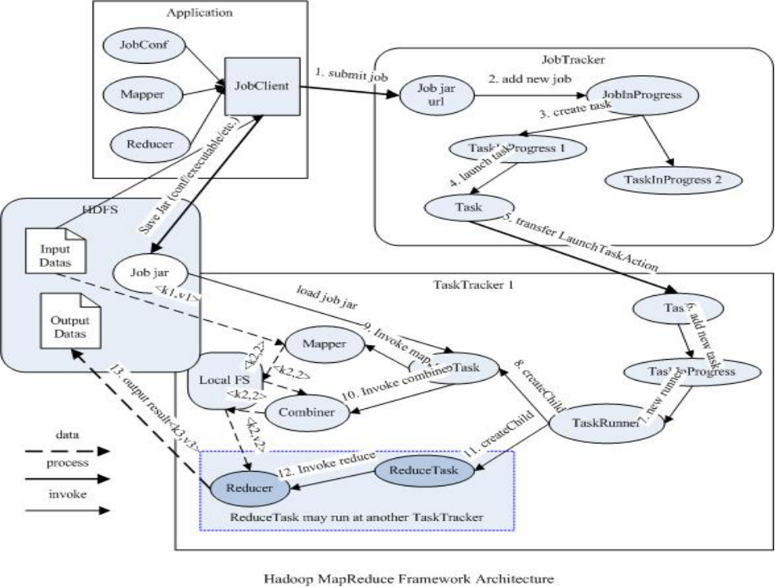

### 序列化

#### 序列化概念
* 序列化（Serialization）是指把结构化对象转化为字节流。
* 反序列化（Deserialization）是序列化的逆过程。即把字节流转回结构化对象。

#### Hadoop序列化的特点

1. 紧凑：高效使用存储空间
2. 快速：读写数据的额外开销小
3. 可扩展：可透明地读取老格式的数据
4. 互操作：支持多语言的交互


#### Hadoop序列化的作用

* 序列化在分布式环境的两大作用：进程间通信，永久存储。
* Hadoop节点间通信。

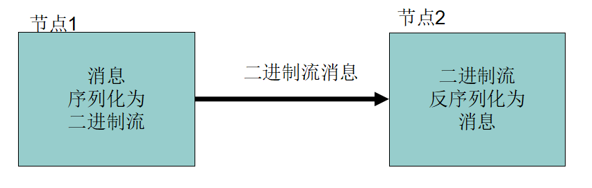

#### Writable接口

* Writable接口, 是根据 DataInput 和 DataOutput 实现的简单、有效的序列化对象。
* MR的任意Key和Value必须实现Writable接口。

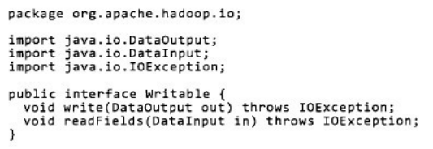

* MR的任意key必须实现WritableComparable接口。

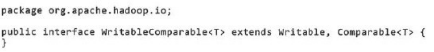

#### 常用的Writable实现类
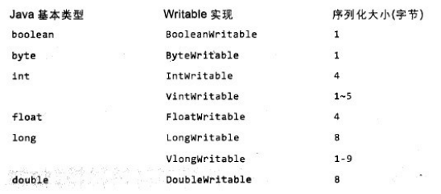

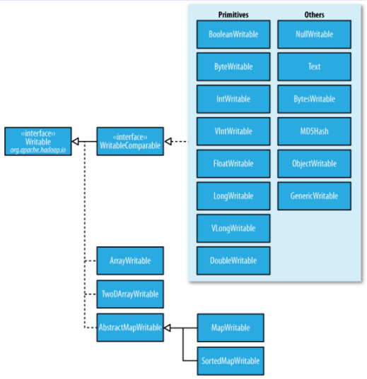

## 九、Hadoop深入浅出

### Partitioner

1. Partitioner是partitioner的基类，如果需要定制partitioner也需要继承该类。

2. HashPartitioner是mapreduce的默认partitioner。计算方法是

    which reducer=(key.hashCode() & Integer.MAX_VALUE) % numReduceTasks，得到当前的目的reducer。

### 排序和分组

1. 在map和reduce阶段进行排序时，比较的是k2。v2是不参与排序比较的。如果要想让v2也进行排序，需要把k2和v2组装成新的类，作为k2，才能参与比较。

2. 分组时也是按照k2进行比较的。

### Combiners

每一个map可能会产生大量的输出，combiner的作用就是在map端对输出先做一次合并，以减少传输到reducer的数据量。
    
combiner最基本是实现本地key的归并，combiner具有类似本地的reduce功能。

如果不用combiner，那么，所有的结果都是reduce完成，效率会相对低下。使用combiner，先完成的map会在本地聚合，提升速度。

注意：Combiner的输出是Reducer的输入，如果Combiner是可插拔的，添加Combiner绝不能改变最终的计算结果。所以Combiner只应该用于那种Reduce的输入key/value与输出key/value类型完全一致，且不影响最终结果的场景。比如累加，最大值等。

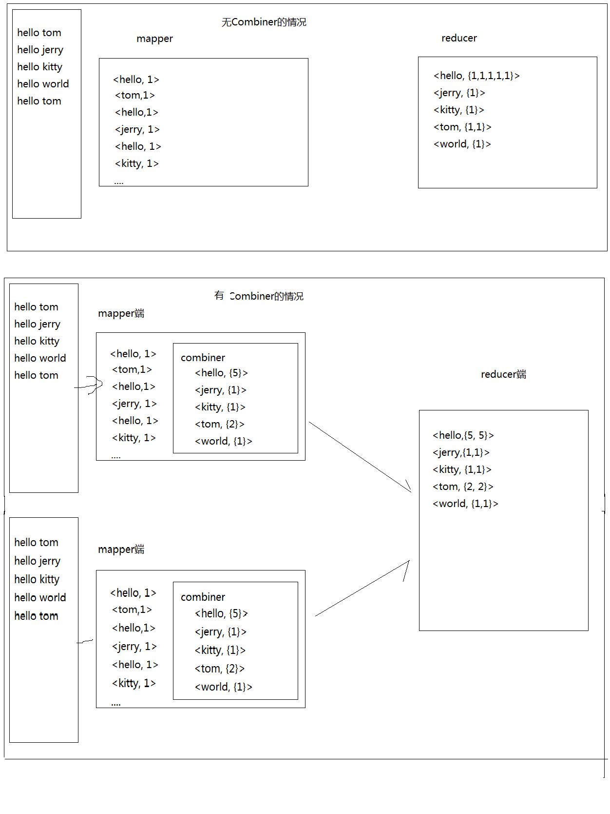

### Shuffer

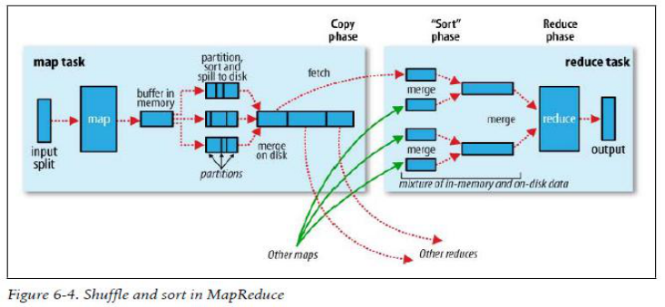

#### mapper
1. 每个map有一个环形内存缓冲区，用于存储任务的输出。默认大小100MB（io.sort.mb属性），一旦达到阀值0.8（io.sort.spill.percent）,一个后台线程把内容写到(spill)磁盘的指定目录（mapred.local.dir）下的新建的一个溢出写文件。
2. 写磁盘前，要partition,sort。如果有combiner，combine排序后数据。
3. 等最后记录写完，合并全部溢出写文件为一个分区且排序的文件。

#### reducer
1. Reducer通过Http方式得到输出文件的分区。
2. TaskTracker为分区文件运行Reduce任务。复制阶段把Map输出复制到Reducer的内存或磁盘。一个Map任务完成，Reduce就开始复制输出。
3. 排序阶段合并map输出。然后走Reduce阶段。

### Zookeeper

#### 什么是Zookeeper

1. Zookeeper 是 Google 的 Chubby一个开源的实现，是 Hadoop 的分布式协调服务
2. 它包含一个简单的原语集，分布式应用程序可以基于它实现同步服务，配置维护和命名服务等

#### 为什么使用Zookeeper

1. 大部分分布式应用需要一个主控、协调器或控制器来管理物理分布的子进程（如资源、任务分配等）
2. 目前，大部分应用需要开发私有的协调程序，缺乏一个通用的机制
3. 协调程序的反复编写浪费，且难以形成通用、伸缩性好的协调器
4. ZooKeeper：提供通用的分布式锁服务，用以协调分布式应用

#### Zookeeper能帮我们做什么

1. Hadoop2.0,使用Zookeeper的事件处理确保整个集群只有一个活跃的NameNode,存储配置信息等

2. HBase,使用Zookeeper的事件处理确保整个集群只有一个HMaster,察觉HRegionServer联机和宕机,存储访问控制列表2


#### HDFS的高可用性（HA）

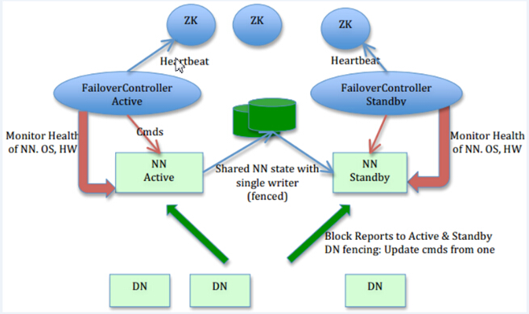


## 十、HBase

### HBase简介

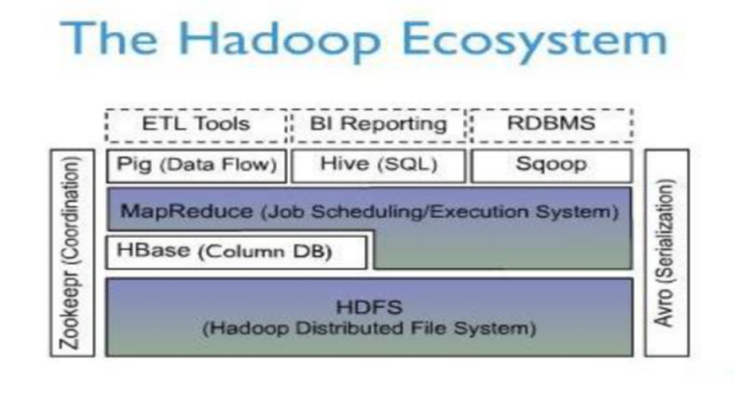


HBase – Hadoop Database，是一个高可靠性、高性能、面向列、可伸缩的分布式存储系统，利用HBase技术可在廉价PC Server上搭建起大规模结构化存储集群。HBase利用Hadoop HDFS作为其文件存储系统，利用Hadoop MapReduce来处理HBase中的海量数据，利用Zookeeper作为协调工具。


### 主键：Row Key

主键是用来检索记录的主键，访问hbase table中的行，只有三种方式
1. 通过单个row key访问
2. 通过row key的range
3. 全表扫描

### 列族：Column Family

列族在创建表的时候声明，一个列族可以包含多个列，列中的数据都是以二进制形式存在，没有数据类型。

### 时间戳：timestamp

HBase中通过row和columns确定的为一个存贮单元称为cell。每个 cell都保存着同一份数据的多个版本。版本通过时间戳来索引。

### HBASE基础知识

HBase中有两张特殊的Table，-ROOT-和.META.

-ROOT- ：记录了.META.表的Region信息，-ROOT-只有一个region

.META. ：记录了用户创建的表的Region信息，.META.可以有多个regoin

 Zookeeper中记录了-ROOT-表的location

Client访问用户数据之前需要首先访问zookeeper，然后访问-ROOT-表，接着访问.META.表，最后才能找到用户数据的位置去访问

（新版HBase已经更新表名）


### HBASE的Java API

#### 初始化
```
//hbase操作必备
    private static Configuration getConfiguration() {
		Configuration conf = HBaseConfiguration.create();
		conf.set("hbase.rootdir", "hdfs://hadoop0:9000/hbase");
		//使用eclipse时必须添加这个，否则无法定位
		conf.set("hbase.zookeeper.quorum", "hadoop0");
		return conf;
	}
```

#### 创建
```
//创建一张表
public static void create(String tableName, String columnFamily) throws IOException{
	HBaseAdmin admin = new HBaseAdmin(getConfiguration());
	if (admin.tableExists(tableName)) {
		System.out.println("table exists!");
	}else{
		HTableDescriptor tableDesc = new HTableDescriptor(tableName);
		tableDesc.addFamily(new HColumnDescriptor(columnFamily));
		admin.createTable(tableDesc);
		System.out.println("create table success!");
	}
}

```

#### 插入
```
//添加一条记录
public static void put(String tableName, String row, String columnFamily, String column, String data) throws IOException{
	HTable table = new HTable(getConfiguration(), tableName);
	Put p1 = new Put(Bytes.toBytes(row));
	p1.add(Bytes.toBytes(columnFamily), Bytes.toBytes(column), 	Bytes.toBytes(data));
	table.put(p1);
	System.out.println("put'"+row+"',"+columnFamily+":"+column+"','"+data+"'");
}

```

#### 查询
```
//读取一条记录
public static void get(String tableName, String row) throws IOException{
	HTable table = new HTable(getConfiguration(), tableName);
	Get get = new Get(Bytes.toBytes(row));
	Result result = table.get(get);
	System.out.println("Get: "+result);
}

```

#### 查询所有
```
//显示所有数据
public static void scan(String tableName) throws IOException{
	HTable table = new HTable(getConfiguration(), tableName);
	Scan scan = new Scan();
	ResultScanner scanner = table.getScanner(scan);
	for (Result result : scanner) {
		System.out.println("Scan: "+result);
	}
}

```

#### 删除
```
//删除表
public static void delete(String tableName) throws IOException{
	HBaseAdmin admin = new HBaseAdmin(getConfiguration());
	if(admin.tableExists(tableName)){
		try {
		  admin.disableTable(tableName);
		  admin.deleteTable(tableName);
		} catch (IOException e) {
		  e.printStackTrace();
		  System.out.println("Delete "+tableName+" 失败");
		}
	}
	System.out.println("Delete "+tableName+" 成功");
}

```

## 十一、Hive

### 1.Hive简介

* Hive 是建立在Hadoop上的数据仓库基础构架。它提供了一系列的工具，可以用来进行数据提取转化加载（ETL ），这是一种可以存储、查询和分析存储在Hadoop中的大规模数据的机制。Hive 定义了简单的类SQL查询语言，称为QL ，它允许熟悉SQL的用户查询数据。同时，这个语言也允许熟悉MapReduce开发者的开发自定义的mapper和reducer来处理内建的mapper和 reducer无法完成的复杂的分析工作。
* Hive是SQL解析引擎，它将SQL语句转译成M/R Job然后在Hadoop执行。
* Hive的表其实就是HDFS的目录/文件，按表名把文件夹分开。如果是分区表，则分区值是子文件夹，可以直接在M/R Job里使用这些数据。


### 2.Hive的系统架构

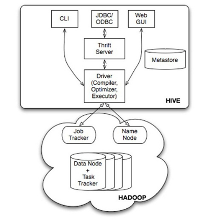

* 用户接口，包括 CLI，JDBC/ODBC，WebUI
* 元数据存储，通常是存储在关系数据库如mysql,derby中
* 解释器、编译器、优化器、执行器
* Hadoop：用HDFS进行存储，利用MapReduce进行计算


* 用户接口主要有三个：CLI，JDBC/ODBC和 WebUI
    1. CLI，即Shell命令行
    2. JDBC/ODBC 是 Hive 的Java，与使用传统数据库JDBC的方式类似
    3. WebGUI是通过浏览器访问 Hive
* Hive 将元数据存储在数据库中(metastore)，目前只支持mysql、derby。Hive中的元数据包括表的名字，表的列和分区及其属性，表的属性（是否为外部表等），表的数据所在目录等
解释器、编译器、优化器完成HQL查询语句从词法分析、语法分析、编译、优化以及查询计划（plan）的生成。生成的查询计划存储在HDFS中，并在随后有MapReduce调用执行
* Hive 的数据存储在HDFS中，大部分的查询由MapReduce完成（包含 * 的查询，比如 select * from table 不会生成MapRedcue任务）

### 3.Hive的metastore
* metastore是hive元数据的集中存放地。metastore默认使用内嵌的derby数据库作为存储引擎
* Derby引擎的缺点：一次只能打开一个会话
* 使用Mysql作为外置存储引擎，多用户同时访问 


### UDF

1. UDF函数可以直接应用于select语句，对查询结构做格式化处理后，再输出内容。
2. 编写UDF函数的时候需要注意一下几点：
    1. 自定义UDF需要继承org.apache.hadoop.hive.ql.UDF。
    2. 需要实现evaluate函数，evaluate函数支持重载。

3. 步骤
    1. 把程序打包放到目标机器上去；
    2. 进入hive客户端，添加jar包：hive>add jar /run/jar/udf_test.jar;
    3. 创建临时函数：hive>CREATE TEMPORARY FUNCTION add_example AS 'hive.udf.Add';
    4. 查询HQL语句：
    
        SELECT add_example(8, 9) FROM scores;
        
        SELECT add_example(scores.math, scores.art) FROM scores;
    
        SELECT add_example(6, 7, 8, 6.8) FROM scores;

    5. 销毁临时函数：hive> DROP TEMPORARY FUNCTION add_example;

注：UDF只能实现一进一出的操作，如果需要实现多进一出，则需要实现UDAF


