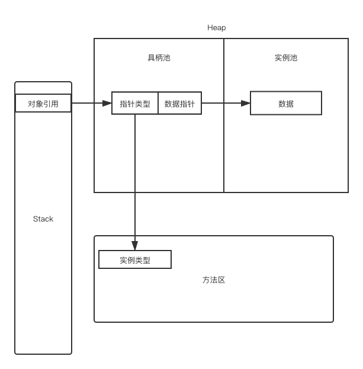
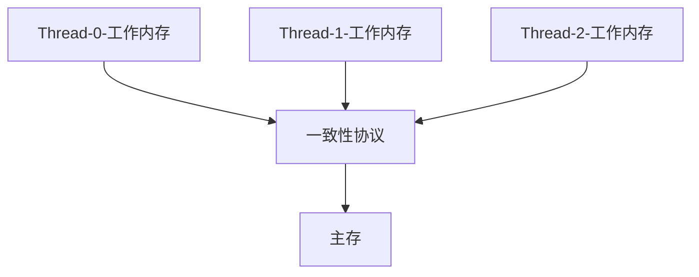
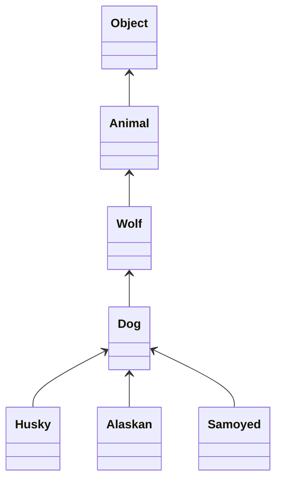

# Java Note

## I 虚拟机内存布局

### 1. JVM运行时 内存布局

| 区域       | 作用                                                   | 线程内存共享    | 异常    | 异常原因                                                     |
| ---------- | ------------------------------------------------------ | --------------- | ------- | ------------------------------------------------------------ |
| 方法区     | 存放类型信息, 常量, 静态变量, JIT代码缓存.             | 线程共享        | OOM     | JVM规范规定, 无法满足内存分配时可抛出.                       |
| 虚拟机栈   | 存储局部变量, 操作数栈,  动态链接, 接口等.             | 线程私有        | OOM, SO | SO: 栈深度超出JVM允许范围;<br/>OOM: 栈扩展失败导致的内存分配不足. |
| 本地方法栈 | 与虚拟机栈功能相同, 但是对象是本地方法(Native Method). | 线程私有        | OOM, SO | 同上.                                                        |
| 堆         | 绝大部分对象在此存储(除了栈上分配和标量替换的对象).    | 共享/私有(TLAB) | OOM     | 堆中无法完成实例分配时抛出.                                  |
| PC计数器   | 下一条指令的地址                                       | 线程私有        | 无      | 无                                                           |

> OOM: OutOfMemoryError
>
> SO: StackOverFlowError
>
> TLAB: 线程私有分配缓冲区 Thread Local Allocation Buffer

### 2. 对象内存布局

堆中对象的布局: 对象头 + 数据 + 对其填充.

对象头: 锁信息, GC信息, 偏向信息.

### 3. 对象访问
#### 3.1 句柄访问

 

#### 3.2 指针访问

.png) 

## II 垃圾回收策略

### 1. 回收理论

#### 对象存活判定

应回收对象的判断: 可达性分析.

> 可达性分析:
>
> 以一些可作为GC Root的对象为根的一棵由引用关系建立起来的树, 当树根死去, 整个棵树上的对象都将不可达.
>
> 什么对象可作为GC Root:
>
> + 虚拟栈中引用的对象
> + 方法区中静态变量所引用的变量
> + 常量引用的对象
> + JVM内部引用(例如一些Class对象, 异常对象, 类加载器)
> + synchronized持有的对象


#### 分代假说

+ 大多数对象都是朝生夕灭的.
+ 几次GC之后仍然存活的对象是不朽的.
+ 跨代引用(新生代, 老年代之间的引用) 是极少的.

所以将需要GC的区域分为Eden区和Survivors区.

新建立的对象放在Eden区.

经过几代GC仍然存活的对象放入Survivors区.


#### 回收算法

1. 标记 - 清除:  (产生大量碎片)
   1. 先标记需要回收的对象.
   2. 清除对象.
2. 标记 - 复制: (将区域划分为两个区域, 回收时从一个区域把存活对象复制到另一个区域, 并且紧密排列)
   1. 先标记要回收的对象.
   2. 复制存活到对象到另一个半区.
3. 标记 - 整理: (移动每次都存活的老年代代价是非常高的, 而且需要暂停用户线程)
   1. 先标记要回收的对象.
   2. 将存活的对象进行整理, 使其紧密排列.

### 2. 回收时机

强引用: 一般的声明的对象, 只要关系存在, 不会被回收.

软引用: 非必须对象,  SoftReference,  在内存溢出之前优先回收.

弱引用: 非必须对象, WeakReference, 一旦触发GC就立刻回收.

虚引用: 不影响对象的声明走起, PhantomReference, 无法取得实例数据, 只能用于接受GC回收的通知.


Minor GC触发:  实例分配失败, Eden区满了.

Full GC触发:  ``System.gc()`` , heap dump,  Survivor区的大小无法满足Minor GC后的对象.

> Minor GC: 只回收新生代

### 3. 回收器例举

#### 3.1 Serial / ParNew

新生代: 标记 - 复制

老年代: 标记 - 清理


#### 3.2 CMS(注重响应时间, 停顿时间短)

使用标记 - 清除算法. 

1. 初始标记: 标记GC Root直接关联的对象. (需要Stop The World)
2. 并发标记: 从GC Root开始遍历对象图. 
3. 重新标记: 修正并发标记时对象的变动. (需要Stop The World)
4. 并发清除. **(Major GC)**

> + CMS无法处理**浮动垃圾**,  因而引发一次Full GC. (浮动垃圾是指CMS在并发清理的时候, 伴随着产生的新垃圾对象.)
>+ CMS收集完成后, 内存空间有碎片存在.

#### 3.3 G1 (Mixed GC)

>  G1将空间分为大小不一的Region, 每个Region可作为Eden, Survivor空间.

GC步骤:

1. 初始标记: 同CMS(需要Stop The World)
2. 并发标记: 同CMS
3. 最终标记: 修正并发标记时对象的变动. (需要Stop The World)
4. 筛选回收: 根据Region的统计数据对Region进行回收

#### 3.4 ZGC

> 与G1一样, 也是使用大小不同的Region拆分回收区域.
>
> 并且使用染色指针技术.(具体原理略)

GC步骤:

1. 并发标记: 同CMS
2. 并发预备重分配: 根据查询条件统计出需要回收的Region.
3. 并发重分配: 把集中存活的对象复制到新Region上.
4. 并发重映射: 修正堆中指向旧对象的引用.

## III 类加载机制

### 1. 类加载步骤

1. 加载: 从不同的源头读取二进制字节流, 并且创建Class对象.

2. 验证: 验证文件.

3. 准备: 为静态变量设定初始值(不是赋语句中定义的值, 而是各类型的默认值, 例如int的默认值是0). 初始在方法区.

4. 解析: 将常量池中的符号引用替换为直接引用. (包括类、接口的解析, 字段的解析, 方法的解析, 接口方法的解析)

5. 初始化: 初始化变量, 赋值实际的值给变量. 执行类构造器\<clinit\>().

   

### 2. 类加载器

> 不同类加载器加载的同一个类在JVM中不视为同一个类.

#### 类加载机制

**双亲委派模型** (递归加载)

1. 遇到要加载的类优先交由父类加载.
2. 父类无法加载的类再由子类加载.


**非双亲委派模型**

1. 线程上下文加载器: 可由父类请求子类类加载器加载.
2. 模块化系统:  若可以找到对应的模块类加载器, 优先派发给其加载. 否则交由父类加载.


### 3. 反射系统

反射系统主要是基于Class对象的操作.

当类加载器从不同渠道加载完Java类后, 都会形成这个类加载器下一一对应的Class对象(当然, 不同的类加载器加载的同一个类不是同一个Class对象).

## IV 多线程并发

### 1. 内存模型

JVM主要解决各个线程的工作内存与主存之间的数据一致性问题.



#### 一致性协议具体内容

+ read - load: 两条指令必须按***顺序***使用, 且必须***成对***出现, read作用于**主存**, load作用于**工作内存**. 目的是为了把**主存**中的变量读入线程**工作内存**变为私有副本.
+ store - write: 两条指令必须按***顺序***使用, 且必须***成对***出现, store作用于**工作内存**, write作用于**主存**. 目的是把**工作内存**中的放入**主存**.
+ use/assign:  作用于**工作内存**, 将**工作内存**中的数据传输给执行引擎/将执行引擎得到的结果赋值给**工作内存**.
+ lock/unlock: 作用于**主存**, 将一个变量锁定🔒/解锁🔓为线程独占的状态. 
  + lock会导致**工作内存**清空, 且需要进行load(主存给出)或者assign(计算引擎给出)对变量进行赋值.
  + 一个变量只能同时被一个线程lock, 但是一个变量可以被同一个线程lock多次, 不过必须有相同数量的unlock.
  + unlock之前必须有store - write 且之前必须被lock锁定.

#### volatile 关键字

提供了有序性: 禁止内存重排序优化\*. 

提供了可见性: 原理是直接将处理机中的Cache无效化, 使得所有线程不得不从主存里读取数据.

**不保证原子性.**


### 2. 线程实现

Thread对象中的run()是Thread对象将执行代码逻辑的部分, 若直接调用则与普通的一个实现了run()方法的类无差别.

Thread对象中的start()方法作用是处理一套进程准备工作(包括调用本地系统调用创建线程). 线程创建完毕后, 将run()中写好的代码注入到该线程中执行该线程.

### 3. 线程安全

定义: 多个线程同时访问一个对象时, 若不考虑线程调度, 交替, 同步手段和任何协调操作, 单次调用该对象可以获得正确结果, 称之为线程安全.

> **线程安全的类就不需要添加同步手段了么?**
>
> 非也.
>
> 大多线程安全的容器都是在方法处加入synchronized关键字, 而非在变量处.
>
> 这就导致两个线程同时使用两个不同的方法对统一对象进行修改, 仍然会出现线程不安全.

#### 实现线程安全编程

> 线程安全的目的是线程之间必须要同步.

**1.  无同步**

+ 使用**纯代码(可重入代码)** , 纯代码具有一些特性, 例如:	
  + 一些不依赖全局变量,共享变量, 不实用公共资源, 所以状态量均由参数传入.
  + 结果是可预测的, 相同的输入, 结果也是相同的.
+ 使用线程本地存储TLS —— Thread Local Storage.

**2. 非阻塞的同步**

>  利用 Test-and-Set, CAS等硬件指令, 实现的轻量级锁,乐观锁. 

其思想是: 

+ 直接在CPU时间里测试目标是否被征用, 若没有被征用直接执行.
+ 若被征用, 则直接在CPU时间内等待, 不去阻塞线程.避免了阻塞/唤醒的线程切换开销.

Java中带有concrrent的类常常使用此类方法进行同步.

**3. 阻塞的同步**

> 使用synchronized和ReentrantLock等实现的重量级锁, 悲观锁.

在内核态, 用户态之间切换, 以阻塞/唤醒线程.

### 4. 锁
#### 4.1 可重入锁  java.util.concurrent.locks.ReentrantLock & synchronized

> 可重入: 是指被中断的函数在调度回来之后可以继续执行.
>
> 不可重入: 是指被中断后返回后的操作已经和不中断的情况不等效了. 例如对公共变量进行操作, 突然被中断.

可重入锁: 同一个线程对一段代码加锁之后, 中断后可再次获得该锁.

ReentrantLock 与 synchronized的区别在于:

+ 公平锁方面: ReentrantLock可选择为公平锁模式, 而synchronized只能为非公平锁.
+ 代码方面: ReentrantLock加锁解锁不受代码块限制, 可以在一个方法中加锁, 另一个方法中解锁; synchronized只能限制在一个代码块中.
+ 等待中断方面: ReentrantLock可在线程长期不释放资源的时候, 等待资源的线程放弃等待.
+ 唤醒条件方面: ReentrantLock可以绑定多个条件.

**synchronized 实现原理:**

在synchronized包裹的代码块的前后插入管程指令.

**ReentrantLock 实现原理: **

> 数据结构: CLH队列 —— 一个基于双向链表的FIFO队列, 它和普通的队列的区别在于加入了对队列中元素的标记, 用于标记排队线程的状态.
>
> PROPAGATE 节点: 唤醒它, 它还会传播式唤醒它后面的节点, 用于实现共享锁.
>
> SIGNAL 节点: 等待前方的节点唤醒自己.
>
> CONDITION 节点: 表示排序线程在**条件队列**中.
>
> CANCELLED 节点: 该线程被取消.
>
> 0: 新进线程的节点.

+ ReentrantLock 使用 AbstractQueuedSynchronizer 来存储两个队列: 条件队列和等待队列.
+ 条件队列和等待队列中存放的都是排队的线程.

> 条件队列与等待队列的作用相似, 都是存放排队的线程. 
>
> 只是一些条件唤醒的线程尚未满足条件, 需要在条件队列中等待, 当满足条件后, 将其加入等待队列, 进行等待.
>
> 进入等待队列的线程, 就开始等待获取锁.

**共享锁的实现**

节点带PROPAGATE标志插入等待队列, 当该节点被唤醒, 会传播唤醒后续节点.

**可重入的实现**

检查该持有锁的线程是不是当前线程, 若是则返回该锁.

**公平/非公平的实现**

公平: 先进入AQS排队.

非公平锁: 基于CAS检测当前是否有线程持有锁, 若没有, 进而直接插队.

#### 4.2 读写锁 Java.util.concurrent.locks.ReentrantReadWriteLock

+ 多个读操作不会阻塞.
+ 一个写操作阻塞所有读操作和所有写操作.

#### 4.3 轻量锁

+ 若检测到无锁定, JVM给要加锁的对象创建一个Lock Record 存储对象头(Mark Word)的拷贝.
+ JVM使用CAS操作更新对象头至Lock Record说明该线程持有了这个锁.
+ 若失败, 说明当前有线程占用该对象.
+ 解锁仍使用CAS操作.

> 轻量级锁只适合至多2个线程的竞争, 多于2个将膨胀为重量级锁.

#### 4.4 偏向锁

+ 该锁将偏向于第一个获得他的线程, 若锁一直没有其他线程获取, 则持有偏向锁的线程永不同步, 直接消除同步.
+ 适用于只有一个线程访问同步块.

#### 4.5 自旋锁

自旋锁: 在对象被锁定的时候, 让下一个请求者稍等一下 —— 即执行一下忙循环不放弃CPU.

自适应自旋锁:  利用算法判定是否使用自旋锁, 或者取消自旋锁.

> 算法思想:
>
> 如果该线程刚刚成功获取到了自旋锁, 那么我们相信他这次也能获得自旋锁.
>
> 若该线程很少成功获得自旋锁, 那么我们就取消自旋锁.

#### 4.6 锁消除

编译器运行时通过**逃逸分析**, 判定数据不会产生**线程逃逸**后进行锁消除.

#### 4.7 锁粗化

将连续的多个对同一个对象的加锁解锁操作粗化为对一个代码块的一次性加锁解锁.

#### 4.8 公平锁/非公平锁

> 定义: 
>
> + 公平锁 —— 按照请求锁的排队顺序分发锁.
>
> + 非公平锁 —— 随机选取正在等待锁的线程, 给予其锁.

synchronized 关键字是非公平锁.

ReentrantLock 默认非公平锁, 但是可以设置为公平锁.

#### 4.9 双锁检测 DCL(Double Check Lock)

原理:

1. 先检测标志, 相关判定条件(例如持有临界资源的时候放置的标志)
2. 检测成功, 则进入临界区, 否则不进入.

优点:

+ 可以在条件不成熟的时候不持有临界资源, 减少消耗.

缺点:

+ 未使用``volatile`` 的标志, 会导致从指令重排序, 导致线程不安全. 解决方法就是对需要检测的标识进行``volatile``标记.

#### 4.10 Atomic类的实现原理

**CAS: check and swap**

原理: 一条CPU指令, 具有原子性.

给出一个期望值, 再给出一个要替换值.

若测试目标符合期望值, 则将目标的值换成要替换的值.

**volatile & CAS**

+ volatile保证可见性和有序性.

+ CAS保证原子性.

CAS的缺点:

1. ABA问题 —— 添加版本号字段, 判定时还要判断是否版本一致.
2. CPU循环开销.
3. 只能操作一个变量.

### 5. 有序性, 可见性, 原子性

> 因为没有原子性而引发并发错误的操作包括但不限于:
>
> + check-then-act
> + read-modify-write

> 重排序是指CPU会将无关的两个变量调序, 以达到更高的性能. 但是这往往会导致非期望的顺序.
>
> 禁止重排序则是将**内存屏障**插入代码中, 将重排序禁用.

#### 5.1 volatitle

volatile具有有序性: 内存屏障; 也具有可见性: 使得Cache失效.

volatile 变量的读操作的确很接近于读取普通变量的速度, 但是写操作需要插入大量的内存屏障, 会产生开销.

但大多数场景性能优于synchronized.

#### 5.2 synchronized

synchronized具有: 有序性, 可见性, 原子性.

#### 5.3 final

不可变对象线程安全.

### 6. long&double

long & double 在 32-bit JVM 下是非原子性协议的, 因为JVM允许2Byte的数据类型分两次读写.

但是64-bit JVM不会出现这种非原子协议的情况.

### 6. 线程池

**线程池的作用:** 

1. 减少频繁申请/销毁线程的资源.
2. 减少无限制申请带来的消耗资源的风险.

**ThreadPoolExecutor的思想:**

+ 首先将任务和线程分离,  任务放在阻塞队列或者立即执行, 线程放在线程池.

+ 线程池和任务队列用一个线程分配器衔接.

+ 线程分配器拿到任务后从线程池中获取线程, 然后再从阻塞队列中拿(也可以选取需要直接执行的任务) 进行执行.

+ 线程池部分则负责线程的创建和回收, 与任务解耦.

**任务调度思想**

线程小于核心数, 线程池正在运行, 即可执行.

否则加入阻塞队列, 若队列满了, 就拒绝任务.

线程池要是未运行, 也拒绝任务.

```java
Callable<V>;// 带返回的, 抛异常的Runnable
Future<V>;
```

### 线程同步

#### notify()/notifyAll() + wait()

缺点: 

+ 过早唤醒: 唤醒条件未成立的情况下, 被提前唤醒.
+ 信号丢失: .wait()被暂停(先notify(), 之后才wait()), 导致没有收到notify进而导致无限等待.
+ 欺骗性唤醒: 没有其他线程执行而导致唤醒(小概率).
+ notifyAll()可导致多个线程的上下文切换, 开销增大.

```java
Object object = new Object();
AtomicBoolean flag = new AtomicBoolean(true);
new Thread(()->{
    synchronized (object) {
        try {
            Thread.sleep(1000);
            while(flag.get()){ //保护条件
                object.wait();
            }
        } catch (InterruptedException e) {
            e.printStackTrace();
        }
        System.out.println(Thread.currentThread().getName() + " is awake.");
    }
}).start();

new Thread(() -> {
    synchronized (object) {
        System.out.println("Prepare for notifying");
        flag.getAndSet(false);
        object.notifyAll();
    }
}).start();
```

#### join()

```java
Thread th1 = new Thread(() -> {
    try {
        Thread.sleep(1000);
    } catch (InterruptedException e) {
        e.printStackTrace();
    }
});

new Thread(()->{
    try {
        th1.join();//后续线程
        System.out.println("awake");
    } catch (InterruptedException e) {
        e.printStackTrace();
    }
}).start();
th1.start();
```


#### Condition 接口

> 可以解决过早唤醒的问题.

```java
final Lock lock = new ReentrantLock(); //不可变对象可以避免许多问题
final Condition condition = lock.newCondition(); //Condition由lock给出
AtomicBoolean flag = new AtomicBoolean(true);
Runnable runnable = ()->{
    lock.lock(); //使用condition之前要上锁, 以防欺骗性唤醒, 提前唤醒, 信号丢失
    try {
        while(flag.get()) {
            condition.await();
        }
        System.out.println(Thread.currentThread().getName() + " is awake");
    } catch (InterruptedException e) {
        e.printStackTrace();
    }finally {
        lock.unlock();
    }
};

new Thread(runnable).start();
new Thread(runnable).start();
new Thread(()->{
    lock.lock(); //使用condition之前要上锁
    try {
        Thread.sleep(1000);
        flag.set(false);
        condition.signalAll();
    } catch (InterruptedException e) {
        e.printStackTrace();
    } finally {
       lock.unlock();
    }
}).start();

```


#### CountDownLatch

```java
final CountDownLatch countDownLatch = new CountDownLatch(3);
Runnable runnable = () -> {
    try {
        Thread.sleep(500);
        System.out.println(countDownLatch.getCount());
        countDownLatch.countDown();
        Thread.sleep(500);
    } catch (InterruptedException e) {
        e.printStackTrace();
    }
    
};

IntStream.range(0,10).forEach(i -> {  // 过多的countDown 只会让 count永远呆在0
    new Thread(runnable).start();
});

new Thread(()->{
    try {
        countDownLatch.await();
    } catch (InterruptedException e) {
        e.printStackTrace();
    }
    System.out.println("finish");
}).start();
```


#### CyclicBarrier

> 原理:
>
> + 线程间阻塞使用ReentrantLock
> + 线程间同步使用Condition

用法:

```java
Runable lastRunnable = () -> {...};
final CyclicBarrier cyclicBarrier = new CyclicBarrier(n, lastRunnable); // n=调用.await()的线程个数
Runable invokeAwaitRunnable = () -> {
  //...
  cyclicBarrier.await();
}
new Thread(invokeAwaitRunnable).start();//await()的调用数量达到n, 则cyclicBarrier自动启动lastRunnable, 无需new Thread(lastRunnable).start();

// 简单同步:
final CyclicBarrier cyclicBarrierSimple = new CyclicBarrier(n); 
Runnable run = ()-> {
  //所有线程都调用await(), 在cyclicBarrierSimple耗尽之前均阻塞, cyclicBarrierSimple一旦耗尽, 则所有调用await()的线程均唤醒.
  cyclicBarrierSimple.await(); 
}
IntStream.range(0,n).forEach(i -> new Thread(run).start());
```


## V 并发容器

### J.U.C.CopyOnWrite系列容器 vs. Collections.synchronizedCollection

> - ``java.util.concurrent.CopyOnWriteArrayList`` vs. ``Collections.synchronizedList``
> - ``java.util.concurrent.CopyOnWriteArraySet`` vs. ``Collections.synchronizedSet`` 

+ CopyOnWrite 写得慢(每次都是复制), 读得快, 但读的是快照, 实时性差.
+ synchronizedCollection 说有操作均加锁, 相比于CopyOnWrite系列容器读得慢, 但写得快, 且实时性很强.

### J.U.C.ConcurrentHashMap vs. Hashtable vs.  Collections.synchronizedMap

+ ConcurrentHashMap: 将table分区, 对某些需要的区域进行加锁.
+ Hashtable: 将整个table全部加锁.
+ synchronizedMap: 对所有操作进行加锁.

### 阻塞队列 vs. 并发队列: ArrayBlockingQueue vs. ConcurrentLinkedQueue vs. LinkedBlockingQueue

> + ``java.util.concurrent.ArrayBlockingQueue``
> + ``java.util.concurrent.ConcurrentLinkedQueue``
> + ``java.util.concurrent.LinkedBlockingQueue``

+ ArrayBlockingQueue: 使用锁 + 数组.
+ ConcurrentLinkedQueue: 使用CAS + 链表.
+ LinkedBlockingQueue: 使用锁 + 链表

>  **J.U.C.SynchronousQueue**  —— 同步队列
>
>  并不是一个实际可用于存储的队列, 它是同步队列, 用于同步生产者消费者.
>
>  ``SynchronousQueue``本身无容量, 所有pull()进去的对象所在的线程都会阻塞, take()会恢复被阻塞的线程.
>
>  类似于PV操作.


## VI 程序编译

### 1. 前端:  Java语法糖

### 泛型系统

>  Java泛型是语法糖, 生成代码时, 会类型擦除, 变成裸类型.

#### 1. 泛型理论: 协变, 逆变, 不变

> 定义: 
>
> + 若 child **extends** parent, 且 f(child) 也是 f(parent)的派生, 称 f()为**协变**.
> + 若 child **extends** parent, 而 f(parent) 是f(child) 的派生, 称f()为**逆变**.
> + 若child **extends** parent, 而f(parent) 和f(child)无派生关系, 称为**不变**.

协变的核心原理是**子类型可以隐式转化为父类型**.

例如 ``Child extends Parent ``且``List<Child> extends List<Parent>`` , 我们称``List<>``是协变的.

试想一下:

``childList = [ch0, ch1, ch2, ...]`` , 当``parentList = childList`` 的时候, 其内部``[p0 = (parent)ch0, p1 = (parent)ch1, ...]`` 很符合情理.

然而, Java泛型是基于类型擦除的泛型, 编译之后所有类型均擦除为裸类型, 所以Java的泛型系统是**不变**的.

具体的:

```java
List<Child> //  类型擦除 --> List
List<Parent> // 类型擦除 --> List
```

编译后均是``List`` 这个裸类型, 因为同为``List``类, 其之间不存在``extends`` 或者 ``super`` 关系, 所以是**不变**.

#### 2. 泛型符号: ? 和 T的区别

T , K, V等字母: 在**定义泛型类型**的时候使用, 定义后在后续的代码块中使用.

```java
//类
public class ClassA<T extends Comparable> {
  private T t;
  T getT() { ... }
  void set(T t){ ... }
}

//或者函数
public static<T extends Comparable> void test(T t){ ... }
```

? 通配符: 在**使用泛型对象**的时候使用, 限定泛型范围.

```java
//例如, List<T> 是一个已经定义好的泛型类型, 是一个泛型容器.
public App{
  public static void copy(List<? super Animal> dst, List<? extends Animal> src){
    
  }
  //...
}
```

通配符指代:

若存在关系



那么

+  ``? extends Dog`` 指代的类型是: Husky, Alaskan, Samoyed以及Dog自己.

+ ``? super Dog`` 指代的类型是: Object, Animal, Wolf 以及Dog自己.

用途:

+ ``? extends Dog`` 也称生产类型. 在数据拷贝的时候, 属于生产方.
+ ``? super Dog`` 也称消费类型. 在数据拷贝的时候, 数据消耗方.

```java
public App{
  public static void copy(List<? super Dog> dst, List<? extends Dog> src){
    // 从子类拷贝数据到父类, 可以保证类型转换到安全.
    src.forEach(dst::add);
  }
  //...
}
```


### 2. 后端: JIT, 编译优化

**逃逸分析**

栈上分配: 无线程逃逸, 将堆中的对象放入栈中.

标量替换: 无方法逃逸, 将符合对象拆分成一个个基本类型.


## VII Java NIO

 

| I/O模型       | 原理                                                         | 缺点            |
| ------------- | ------------------------------------------------------------ | --------------- |
| BlockingI/O   | 数据等待、数据传输时均被阻塞.                                | 直接阻塞进程    |
| non-Block I/O | 用户进程循环询问Kernel; 请求后直接得到结果:数据或者错误.     | 轮询消耗CPU资源 |
| 多路复用      | 多个I/O注册到同一个复用器上, 若无可读的数据进程阻塞;  若有可用数据则唤醒进程进行读取.<br>被select函数阻塞, 而不是被Socket I/O阻塞. | 实现难度大      |
| AIO           | 利用系统调用epoll, 内核准备完成后通知进程, 实现真正的异步IO. | 实现难度大      |


### java.nio.ByteBuffer

```java
flip(); //保留limit到上次的位置, position归零, 用于读之前.
clear(); //全部归零, limit=capacity
rewind();//limit, position归零, 用于重写之前.
```


### java.nio.channels.*

## 杂项 

### HashMap 原理

**存储原理**

+ HashMap由一个数组组成, 使用拉链法进行存储.
+ 当某个桶中节点大于等于8个, 链表化为红黑树.
+ 当某个桶中节点小于等于6个时, 红黑树化为链表.

> > **大于等于8个元素时, 为什么要化为红黑树?**
> >
> > 元素过多, 树形数据结构的搜索速度是$O(\lg n)$ 而线性结构是$O(n)$ .
> >
> > 所以应该使用BST之类的树, 例如AVL, 红黑树.
>
> > **为什么使用红黑树这个结构?** 
> >
> > 红黑树等价于4阶B树, 在失衡的时候, 其等价于B树2、3阶的节点吸收了失衡, 相比于AVL减少了旋转次数.
>
> > **为什么化为树的阈值是8**? 
> >
> > + TreeNodes占用空间是普通Nodes的两倍, 过早的化为树, 空间代价过高;过晚的化为树, 搜索的时间代价过高.
> > + 理想情况下随机hashCode算法下所有桶中节点的分布频率会遵循**泊松分布**, 当某个节点大于8的时候, 其概率为100万分之6. [*注](https://www.javazhiyin.com/34651.html) 
>
> > **为什么化为链表的阈值是6?**
> >
> > 因为在8个节点左右反复插入删除, 会导致反复的链表和树的转化, 引起波动.

### 反射的代价

+ 检查方法可见性
+ 校验参数
+ JIT无法优化

#### 将非try-with的对象封装成可try-with的对象

+ 实现AutoCloseable接口

### 线程异常捕获 —— UncaughtExceptionHandler

```java
Thread.setDefaultUncaughtExceptionHandler((Thread t, Throwable e) ->{
		System.err.println(t.getName() + " " + e);
});
```


### 写单例需要考虑的

+ 初始化的线程安全.
+ 反射干涉内部成员的初始化.
+ 序列化带来的问题.
+ 效率.

#### 解决线程安全 & 反射 & 序列化

```java
public class SignletonClass implements Serializable{
  private SignletonClass(){
    if(DataHolder.LAZY != null) throw new RuntimeException("Error"); //解决反射
  }
  public static final SignletonClass getInstance(){
    return InstanceHolder.LAZY;
  }
  private static class InstanceHolder{
    private static final SignletonClass LAZY = new SignletonClass(); //解决线程安全
  }
  
  @override
  private Object readResolve(){ //重写readResolve()解决序列化
    return SignletonClass.getInstance();
  }
}
```


#### 枚举式单例

```java
public enum EnumSingleton{ // 枚举类自带屏蔽反射, 序列化, 其初始化也是线程安全的, 效率也高.
  INSTANCE;
  private Object data;
  //getter & setter..
  public static EnumSingleton getInstance(){
    return INSTANCE;
  }
}
```


### String vs. StringBuffer vs. StringBuilder

+ StringBuffer和StringBuilder在拼接字符串的时候均不会产生新的对象, 用法大体相同, 只是前者线程安全, 后者线程不安全.
+ StringBuilder的速度比StringBuffer高.

