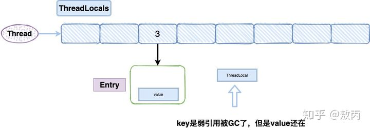

# JAVA基础

[TOC]

## HashMap内部结构及扩容原理

HashMap 是基于拉链法实现的一个散列表，内部由数组和链表和红黑树实现。

1、数组的初始容量为16，而容量是以2的次方扩充的，一是为了提高性能使用足够大的数组，二是为了能使用位运算代替取模预算(据说提升了 5~8 倍)。

2、数组是否需要扩充是通过负载因子判断的，如果当前元素个数为数组容量的 0.75 时，就会扩充数组。这个 0.75 就是默认的负载因子，可由构造传入。我们也可以设置大于 1 的负载因子，这样数组就不会扩充，牺牲性能，节省内存。

3、为了解决碰撞，数组中的元素是单向链表类型。当链表长度到达一个阈值时(7或8)，会将链表转换成红黑树提高性能。而当链表长度缩小到另一个阈值时(6)，又会将红黑树转换回单向链表提高性能，这里是一个平衡点。

4、对于第三点补充说明，检查链表长度转换成红黑树之前，还会先检测当前数组数组是否到达一个阈值(64)，如果没有到达这个容量，会放弃转换，先去扩充数组。所以上面也说了链表长度的阈值是 7 或 8，因为会有一次放弃转换的操作。

## ThreadLocal详解
### 主要作用
ThreadLocal的作用主要是做数据隔离，填充的数据只属于当前线程，变量的数据对别的线程而言是相对隔离的，在多线程环境下，如何防止自己的变量被其它线程篡改。

### 应用场景

之前我们上线后发现部分用户的日期居然不对了，排查下来是SimpleDataFormat的锅，当时我们使用SimpleDataFormat的parse()方法，内部有一个Calendar对象，调用SimpleDataFormat的parse()方法会先调用Calendar.clear（），然后调用Calendar.add()，如果一个线程先调用了add()然后另一个线程又调用了clear()，这时候parse()方法解析的时间就不对了。其实要解决这个问题很简单，让每个线程都new 一个自己的 SimpleDataFormat就好了，但是1000个线程难道new1000个SimpleDataFormat？所以当时我们使用了线程池加上ThreadLocal包装SimpleDataFormat，再调用initialValue让每个线程有一个SimpleDataFormat的副本，从而解决了线程安全的问题，也提高了性能。

### ThreadLocal的内存泄漏

ThreadLocal在保存的时候会把自己当做Key存在ThreadLocalMap中，正常情况应该是key和value都应该被外界强引用才对，但是现在key被设计成WeakReference弱引用了。

我先给大家介绍一下弱引用：

> 只具有弱引用的对象拥有更短暂的生命周期，在垃圾回收器线程扫描它所管辖的内存区域的过程中，一旦发现了只具有弱引用的对象，不管当前内存空间足够与否，都会回收它的内存。  不过，由于垃圾回收器是一个优先级很低的线程，因此不一定会很快发现那些只具有弱引用的对象。

这就导致了一个问题，ThreadLocal在没有外部强引用时，发生GC时会被回收，如果创建ThreadLocal的线程一直持续运行，那么这个Entry对象中的value就有可能一直得不到回收，发生内存泄露。

就比如线程池里面的线程，线程都是复用的，那么之前的线程实例处理完之后，出于复用的目的线程依然存活，所以，ThreadLocal设定的value值被持有，导致内存泄露。

按照道理一个线程使用完，ThreadLocalMap是应该要被清空的，但是现在线程被复用了。

解决方案：代码的最后使用remove就好了，我们只要记得在使用的最后用remove把值清空就好了。

