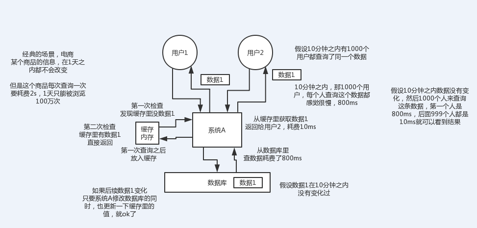
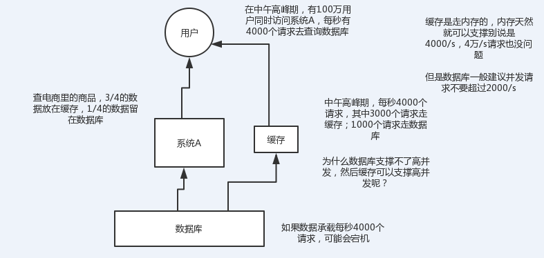
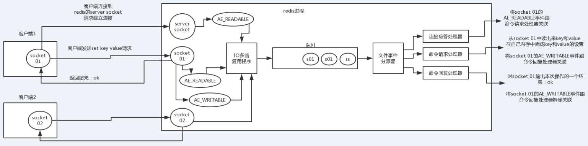
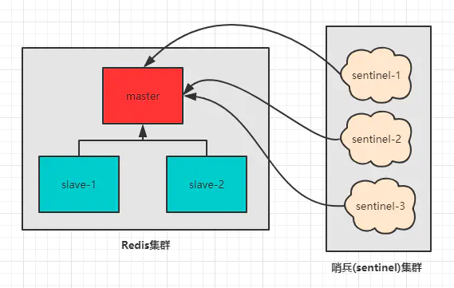
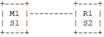
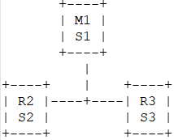

# redis基础

[TOC]

## 一、缓存


### 缓存的目的

* 高性能



* 高并发




### 缓存的缺点

1）缓存与数据库双写不一致

2）缓存雪崩

3）缓存穿透

4）缓存并发竞争


## 二、redis

### redis和memcached的区别

1）Redis支持服务器端的数据操作：Redis相比Memcached来说，拥有更多的数据结构和并支持更丰富的数据操作，通常在Memcached里，你需要将数据拿到客户端来进行类似的修改再set回去。这大大增加了网络IO的次数和数据体积。在Redis中，这些复杂的操作通常和一般的GET/SET一样高效。所以，如果需要缓存能够支持更复杂的结构和操作，那么Redis会是不错的选择。

2）集群模式：memcached没有原生的集群模式，需要依靠客户端来实现往集群中分片写入数据；但是redis目前是原生支持cluster模式的，redis官方就是支持redis cluster集群模式的，比memcached来说要更好。


### redis的单线程模型

#### 1）文件事件处理器

redis基于reactor模式开发了网络事件处理器，这个处理器叫做文件事件处理器，file event handler。这个文件事件处理器，是单线程的，redis才叫做单线程的模型，采用IO多路复用机制同时监听多个socket，根据socket上的事件来选择对应的事件处理器来处理这个事件。

如果被监听的socket准备好执行accept、read、write、close等操作的时候，跟操作对应的文件事件就会产生，这个时候文件事件处理器就会调用之前关联好的事件处理器来处理这个事件。

文件事件处理器是单线程模式运行的，但是通过IO多路复用机制监听多个socket，可以实现高性能的网络通信模型，又可以跟内部其他单线程的模块进行对接，保证了redis内部的线程模型的简单性。

文件事件处理器的结构包含4个部分：多个socket，IO多路复用程序，文件事件分派器，事件处理器（命令请求处理器、命令回复处理器、连接应答处理器，等等）。

多个socket可能并发的产生不同的操作，每个操作对应不同的文件事件，但是IO多路复用程序会监听多个socket，但是会将socket放入一个队列中排队，每次从队列中取出一个socket给事件分派器，事件分派器把socket给对应的事件处理器。

然后一个socket的事件处理完之后，IO多路复用程序才会将队列中的下一个socket给事件分派器。文件事件分派器会根据每个socket当前产生的事件，来选择对应的事件处理器来处理。


#### 2）文件事件

当socket变得可读时（比如客户端对redis执行write操作，或者close操作），或者有新的可以应答的sccket出现时（客户端对redis执行connect操作），socket就会产生一个AE_READABLE事件。

当socket变得可写的时候（客户端对redis执行read操作），socket会产生一个AE_WRITABLE事件。

IO多路复用程序可以同时监听AE_REABLE和AE_WRITABLE两种事件，要是一个socket同时产生了AE_READABLE和AE_WRITABLE两种事件，那么文件事件分派器优先处理AE_REABLE事件，然后才是AE_WRITABLE事件。


#### 3）文件事件处理器

如果是客户端要连接redis，那么会为socket关联连接应答处理器

如果是客户端要写数据到redis，那么会为socket关联命令请求处理器

如果是客户端要从redis读数据，那么会为socket关联命令回复处理器


#### 4）客户端与redis通信的一次流程

在redis启动初始化的时候，redis会将连接应答处理器跟AE_READABLE事件关联起来，接着如果一个客户端跟redis发起连接，此时会产生一个AE_READABLE事件，然后由连接应答处理器来处理跟客户端建立连接，创建客户端对应的socket，同时将这个socket的AE_READABLE事件跟命令请求处理器关联起来。

当客户端向redis发起请求的时候（不管是读请求还是写请求，都一样），首先就会在socket产生一个AE_READABLE事件，然后由对应的命令请求处理器来处理。这个命令请求处理器就会从socket中读取请求相关数据，然后进行执行和处理。

接着redis这边准备好了给客户端的响应数据之后，就会将socket的AE_WRITABLE事件跟命令回复处理器关联起来，当客户端这边准备好读取响应数据时，就会在socket上产生一个AE_WRITABLE事件，会由对应的命令回复处理器来处理，就是将准备好的响应数据写入socket，供客户端来读取。

命令回复处理器写完之后，就会删除这个socket的AE_WRITABLE事件和命令回复处理器的关联关系。





### 为啥redis单线程模型也能效率这么高？

1）纯内存操作

2）核心是基于非阻塞的IO多路复用机制

3）单线程反而避免了多线程的频繁上下文切换问题

### redis的数据类型

（1）String

基本类型，普通的set和get，做简单的kv缓存。

（2）Hash

类似于map的一种结构，一般可以将结构化的数据，比如一个对象给缓存在redis里，然后每次读写缓存的时候，可以就操作hash里的某个字段。

（3）List

有序列表，可以有重复数据。

比如可以通过list存储一些列表型的数据结构；比如可以通过lrange命令，可以从某个元素开始读取多少个元素，可以基于list实现分页查询；比如可以做一个消息队里，从list的头进入，尾巴那里弄出来。

（4）set

无需集合，自动去重。

基于set将系统里需要去重的数据放进去，就可以实现自动去重。也可以基于set实现交集、并集和差集的操作。

（5）sorted set

排序的set，去重同时也可以实现排序。


### redis的过期策略

**缓存是基于内存的，而内存是有限的。**

#### 过期策略

定期删除+惰性删除

所谓定期删除，指的是redis默认是每隔100ms就随机抽取一些设置了过期时间的key，检查其是否过期，如果过期就删除。假设redis里放了10万个key，都设置了过期时间，你每隔几百毫秒，就检查10万个key，那redis基本上就死了，cpu负载会很高的，消耗在你的检查过期key上了。注意，这里可不是每隔100ms就遍历所有的设置过期时间的key，那样就是一场性能上的灾难。实际上redis是每隔100ms随机抽取一些key来检查和删除的。

但是问题是，定期删除可能会导致很多过期key到了时间并没有被删除掉，那咋整呢？所以就是惰性删除了。这就是说，在你获取某个key的时候，redis会检查一下 ，这个key如果设置了过期时间那么是否过期了？如果过期了此时就会删除，不会给你返回任何东西。

并不是key到时间就被删除掉，而是你查询这个key的时候，redis再懒惰的检查一下。

通过上述两种手段结合起来，保证过期的key一定会被删除。

缺点：

但是实际上这还是有问题的，如果定期删除漏掉了很多过期key，然后也没及时去查，也就没走惰性删除。大量数据就会堆积在内存里。

这时候就会使用到内存淘汰机制。

#### 内存淘汰

如果redis的内存占用过多的时候，此时会进行内存淘汰，有如下一些策略：

1）noeviction：当内存不足以容纳新写入数据时，新写入操作会报错，这个一般没人用

2）allkeys-lru：当内存不足以容纳新写入数据时，在键空间中，移除最近最少使用的key（这个是最常用的）

3）allkeys-random：当内存不足以容纳新写入数据时，在键空间中，随机移除某个key，这个一般没人用吧，为啥要随机，肯定是把最近最少使用的key给干掉啊

4）volatile-lru：当内存不足以容纳新写入数据时，在设置了过期时间的键空间中，移除最近最少使用的key（这个一般不太合适）

5）volatile-random：当内存不足以容纳新写入数据时，在设置了过期时间的键空间中，随机移除某个key

6）volatile-ttl：当内存不足以容纳新写入数据时，在设置了过期时间的键空间中，有更早过期时间的key优先移除

#### LRU算法实现（JAVA版）
```
public class LRUCache<K, V> extends LinkedHashMap<K, V> {
    
private final int CACHE_SIZE;

    // 这里就是传递进来最多能缓存多少数据
    public LRUCache(int cacheSize) {
        super((int) Math.ceil(cacheSize / 0.75) + 1, 0.75f, true); // 这块就是设置一个hashmap的初始大小，同时最后一个true指的是让linkedhashmap按照访问顺序来进行排序，最近访问的放在头，最老访问的就在尾
        CACHE_SIZE = cacheSize;
    }

    @Override
    protected boolean removeEldestEntry(Map.Entry eldest) {
        return size() > CACHE_SIZE; // 这个意思就是说当map中的数据量大于指定的缓存个数的时候，就自动删除最老的数据
    }

}
```

### redis的高并发和高可用

* redis高并发：主从架构，一主多从，一般来说，很多项目其实就足够了，单主用来写入数据，单机几万QPS（每秒能处理查询数目），多从用来查询数据，多个从实例可以提供每秒10万的QPS。redis高并发的同时，还需要容纳大量的数据：一主多从，每个实例都容纳了完整的数据，比如redis主就10g的内存量，其实你就最对只能容纳10g的数据量。如果你的缓存要容纳的数据量很大，达到了几十g，甚至几百g，或者是几t，那你就需要redis集群，而且用redis集群之后，可以提供可能每秒几十万的读写并发。

* redis高可用：如果你做主从架构部署，其实就是加上哨兵就可以了，就可以实现，任何一个实例宕机，自动会进行主备切换。


#### 高并发

##### 1）redis高并发跟整个系统的高并发之间的关系

redis，要高并发的话，首先要把底层的缓存搞得很好

mysql的高并发，是通过一系列复杂的分库分表

光是redis是不够的，但是redis是整个大型的缓存架构中，支撑高并发的架构里面，非常重要的一个环节

首先，你的底层的缓存中间件，缓存系统，必须能够支撑的起我们说的那种高并发，其次，再经过良好的整体的缓存架构的设计（多级缓存架构、热点缓存），支撑真正的上十万，甚至上百万的高并发

##### 2）redis不能支撑高并发的瓶颈在哪里

**单机**

单机redis能够承载的QPS大概在上万到几万不等，不足以支持几十万的QPS，数据量过大，单机redis就会出现卡死的情况。


##### 3）如果redis要支撑超过10万+的并发，那应该怎么做

**读写分离**

对于缓存来说，一般都是用于支撑读的高并发，写的请求是比较少的。

架构做成主从架构，一主多从，主负责写，并且将数据同步到它的slave节点，所有的读请求全部走slave节点。

如果并发量增大，就可以进行水平扩容，继续增加redis slave节点就可以了。


#### redis replication（主从架构）

redis主从架构 -> 读写分离架构 -> 可支持水平扩展的读高并发架构

##### 1）redis replication的核心机制

（1）redis采用**异步**方式复制数据到slave节点，不过redis 2.8开始，slave node会周期性地确认自己每次复制的数据量

（2）一个master node是可以配置多个slave node的

（3）slave node也可以连接其他的slave node

（4）slave node做复制的时候，是不会block master node的正常工作的

（5）slave node在做复制的时候，也不会block对自己的查询操作，它会用旧的数据集来提供服务; 但是复制完成的时候，需要删除旧数据集，加载新数据集，这个时候就会暂停对外服务了

（6）slave node主要用来进行横向扩容，做读写分离，扩容的slave node可以提高读的吞吐量

##### 2）master持久化对于主从架构的安全保障的意义

如果采用了主从架构，那么建议必须开启master node的持久化！

1) 不建议用slave node作为master node的数据热备，因为那样的话，如果你关掉master的持久化，可能在master宕机重启的时候数据是空的，然后可能一经过复制，salve node数据也丢了

    master宕机，重启，是没有本地数据可以恢复的，然后就会直接认为自己IDE数据是空的,master就会将空的数据集同步到slave上去，所有slave的数据全部清空,100%的数据丢失。所以master节点，必须要使用持久化机制

2) 第二个，master的各种备份方案，要不要做，万一说本地的所有文件丢失了; 从备份中挑选一份RDB去恢复master; 这样才能确保master启动的时候，是有数据的

    即使采用了后续讲解的高可用机制，slave node可以自动接管master node，但是也可能sentinal还没有检测到master failure，master node就自动重启了，还是可能导致上面的所有slave node数据清空故障


##### 3）主从架构的核心原理


当启动一个slave node的时候，它会发送一个PSYNC（复制）命令给master node（第一次启动slave node时是全量复制）。

**如果这是slave node重新连接master node，那么master node仅仅会复制给slave部分缺少的数据; 否则如果是slave node第一次连接master node，那么会触发一次full resynchronization（全量复制）。**

开始full resynchronization的时候，master会启动一个后台线程，开始生成一份RDB（Redis在内存存储的数据在某一时刻的快照）快照文件，同时还会将从客户端收到的所有写命令缓存在内存中。RDB文件生成完毕之后，master会将这个RDB发送给slave，slave会先写入本地磁盘，然后再从本地磁盘加载到内存中。然后master会将内存中缓存的写命令发送给slave，slave也会同步这些数据。

slave node如果跟master node有网络故障，断开了连接，会自动重连。master如果发现有多个slave node都来重新连接，仅仅会启动一个RDB save操作，用一份数据服务所有slave node。

##### 4）主从复制的断点续传

从redis 2.8开始，就支持主从复制的断点续传，如果主从复制过程中，网络连接断掉了，那么可以接着上次复制的地方，继续复制下去，而不是从头开始复制一份。

master node会在内存中常见一个backlog，master和slave都会保存一个replica offset还有一个master id，offset就是保存在backlog中的。如果master和slave网络连接断掉了，slave会让master从上次的replica offset开始继续复制。

但是如果没有找到对应的offset，那么就会执行一次full resynchronization。


##### 5）无磁盘化复制

master在内存中直接创建RDB，然后发送给slave，不会在自己本地落地磁盘了

``` 
repl-diskless-sync yes/no 开启/关闭

repl-diskless-sync-delay 5 等待一定时长再开始复制（单位秒），因为要等更多slave重新连接过来
```


##### 6）过期key处理

slave不会过期key，只会等待master过期key。如果master过期了一个key，或者通过LRU淘汰了一个key，那么会模拟一条del命令发送给slave。


####  replication的完整流运行程和原理的再次深入剖析

##### 1）复制完整流程

（1）slave node启动，仅仅保存master node的信息，包括master node的host和ip，但是复制流程没开始，master host和ip是从redis.conf里面的slaveof配置的。

（2）slave node内部有个定时任务，每秒检查是否有新的master node要连接和复制，如果发现，就跟master node建立socket网络连接。

（3）slave node发送ping命令给master node。

（4）口令认证，如果master设置了requirepass，那么salve node必须发送masterauth的口令过去进行认证。

（5）master node**第一次**执行全量复制，将所有数据发给slave node。

（6）master node后续持续将写命令，异步复制给slave node。

##### 2）数据同步相关的核心机制（第一次slave连接msater的时候，执行的全量复制）

###### （1）master和slave都会维护一个offset

* master会在自身不断累加offset，slave也会在自身不断累加offset

* slave每秒都会上报自己的offset给master，同时master也会保存每个slave的offset

* 这个倒不是说特定就用在全量复制的，主要是master和slave都要知道各自的数据的offset，才能知道互相之间的数据不一致的情况

###### （2）backlog

* master node有一个backlog，默认是1MB大小

* master node给slave node复制数据时，也会将数据在backlog中同步写一份

* backlog主要是用来做全量复制中断候的增量复制的

###### （3）master run id

* info server，可以看到master run id

* 如果根据host+ip定位master node，是不靠谱的，如果master node重启或者数据出现了变化，那么slave node应该根据不同的run id区分，run id不同就做全量复制

* 如果需要不更改run id重启redis，可以使用redis-cli debug reload命令

###### （4）psync

* 从节点使用psync从master node进行复制，psync runid offset

* master node会根据自身的情况返回响应信息，可能是FULLRESYNC runid offset触发全量复制，可能是CONTINUE触发增量复制

##### 3）全量复制

（1）master执行bgsave，在本地生成一份RDB快照文件

（2）master node将RDB快照文件发送给salve node，如果RDB复制时间超过60秒（repl-timeout），那么slave node就会认为复制失败，可以适当调节大这个参数

（3）对于千兆网卡的机器，一般每秒传输100MB，6G文件，很可能超过60s

（4）master node在生成RDB时，会将所有新的写命令缓存在内存中，在salve node保存了RDB之后，再将新的写命令复制给salve node

（5）client-output-buffer-limit slave 256MB 64MB 60，如果在复制期间（60s），内存缓冲区持续消耗超过64MB，或者一次性超过256MB，那么停止复制，复制失败

（6）slave node接收到RDB之后，清空自己的旧数据，然后重新加载RDB到自己的内存中，同时基于旧的数据版本对外提供服务

（7）如果slave node开启了AOF，那么会立即执行BGREWRITEAOF，重写AOF

* RDB生成、RDB通过网络拷贝、slave旧数据的清理、slave aof rewrite，很耗费时间

* 如果复制的数据量在4G~6G之间，那么很可能全量复制时间消耗到1分半到2分钟


##### 4）增量复制

（1）如果全量复制过程中，master-slave网络连接断掉，那么salve重新连接master时，会触发增量复制

（2）master直接从自己的backlog中获取部分丢失的数据，发送给slave node，默认backlog就是1MB

（3）msater就是根据slave发送的psync中的offset来从backlog中获取数据的


##### 5）heartbeat

* 主从节点互相都会发送heartbeat信息

* master默认每隔10秒发送一次heartbeat，salve node每隔1秒发送一个heartbeat


##### 6）异步复制

master每次接收到写命令之后，现在内部写入数据，然后异步发送给slave node


#### 主从架构下如何保证高可用性

##### Sentinel（哨兵）

简单的主从集群有个问题，就是主节点挂了之后，无法从新选举新的节点作为主节点进行写操作，导致服务不可用。所以接下来介绍Sentinel（哨兵）功能的使用。哨兵是一个独立的进程，哨兵会实时监控master节点的状态，当master不可用时会从slave节点中选出一个作为新的master，并修改其他节点的配置指向到新的master。

哨兵是redis集群架构中非常重要的一个组件，主要功能如下：

（1）集群监控，负责监控redis master和slave进程是否正常工作

（2）消息通知，如果某个redis实例有故障，那么哨兵负责发送消息作为报警通知给管理员

（3）故障转移，如果master node挂掉了，会自动转移到slave node上

（4）配置中心，如果故障转移发生了，通知client客户端新的master地址

该系统执行以下三个任务：

* 监控（Monitoring）：Sentinel 会不断地检查你的主服务器和从服务器是否运作正常。
* 提醒（Notification）：当被监控的某个 Redis 服务器出现问题时， Sentinel 可以通过 API 向管理员或者其他应用程序发送通知。
* 自动故障迁移（Automatic failover）： 当一个主服务器不能正常工作时， Sentinel 会开始一次自动故障迁移操作， 它会将失效主服务器的其中一个从服务器升级为新的主服务器， 并让失效主服务器的其他从服务器改为复制新的主服务器； 当客户端试图连接失效的主服务器时， 集群也会向客户端返回新主服务器的地址， 使得集群可以使用新主服务器代替失效服务器。



##### 哨兵的核心知识

**（1）哨兵至少需要3个实例，来保证自己的健壮性**

**（2）哨兵 + redis主从的部署架构，是不会保证数据零丢失的，只能保证redis集群的高可用性**

**（3）对于哨兵 + redis主从这种复杂的部署架构，尽量在测试环境和生产环境，都进行充足的测试和演练**


##### 为什么redis哨兵集群只有2个节点无法正常工作



哨兵集群必须部署2个以上节点

如果哨兵集群仅仅部署了个2个哨兵实例，quorum=1

Configuration: quorum = 1

master宕机，s1和s2中只要有1个哨兵认为master宕机就可以进行切换，同时s1和s2中会选举出一个哨兵来执行故障转移

同时这个时候，需要majority，也就是大多数哨兵都是运行的，2个哨兵的majority就是2（2的majority=2，3的majority=2，5的majority=3，4的majority=2），2个哨兵都运行着，就可以允许执行故障转移

但是如果整个M1和S1运行的机器宕机了，那么哨兵只有1个了，此时就没有majority来允许执行故障转移，虽然另外一台机器还有一个R1，但是故障转移不会执行


##### 经典的3节点哨兵集群



Configuration: quorum = 2，majority

如果M1所在机器宕机了，那么三个哨兵还剩下2个，S2和S3可以一致认为master宕机，然后选举出一个来执行故障转移

同时3个哨兵的majority是2，所以还剩下的2个哨兵运行着，就可以允许执行故障转移

##### 哨兵主备切换的数据丢失问题


###### （1）异步复制导致的数据丢失

因为master -> slave的复制是异步的，所以可能有部分数据还没复制到slave，master就宕机了，此时这些部分数据就丢失了。


###### （2）脑裂导致的数据丢失

脑裂，也就是说，某个master所在机器突然脱离了正常的网络，跟其他slave机器不能连接，但是实际上master还运行着

此时哨兵可能就会认为master宕机了，然后开启选举，将其他slave切换成了master

这个时候，集群里就会有两个master，也就是所谓的脑裂

此时虽然某个slave被切换成了master，但是可能client还没来得及切换到新的master，还继续写向旧master的数据可能也丢失了

因此旧master再次恢复的时候，会被作为一个slave挂到新的master上去，自己的数据会清空，重新从新的master复制数据


###### （3）解决异步复制和脑裂导致的数据丢失

``` 
min-slaves-to-write 1

min-slaves-max-lag 10
```

要求至少有**1**个slave，数据复制和同步的延迟不能超过**10**秒

如果说一旦所有的slave，数据复制和同步的延迟都超过了10秒钟，那么这个时候，master就不会再接收任何请求了

上面两个配置可以减少异步复制和脑裂导致的数据丢失

（1）减少异步复制的数据丢失

有了min-slaves-max-lag这个配置，就可以确保说，一旦slave复制数据和ack延时太长，就认为可能master宕机后损失的数据太多了，那么就拒绝写请求，这样可以把master宕机时由于部分数据未同步到slave导致的数据丢失降低的可控范围内

（2）减少脑裂的数据丢失

如果一个master出现了脑裂，跟其他slave丢了连接，那么上面两个配置可以确保说，如果不能继续给指定数量的slave发送数据，而且slave超过10秒没有给自己ack消息，那么就直接拒绝客户端的写请求

这样脑裂后的旧master就不会接受client的新数据，也就避免了数据丢失

上面的配置就确保了，如果跟任何一个slave丢了连接，在10秒后发现没有slave给自己ack，那么就拒绝新的写请求

因此在脑裂场景下，最多就丢失10秒的数据


##### 哨兵的多个核心底层原理的深入解析

###### 1、sdown和odown转换机制

sdown和odown两种失败状态

sdown是主观宕机，就一个哨兵如果自己觉得一个master宕机了，那么就是主观宕机

odown是客观宕机，如果quorum数量的哨兵都觉得一个master宕机了，那么就是客观宕机

sdown达成的条件很简单，如果一个哨兵ping一个master，超过了is-master-down-after-milliseconds指定的毫秒数之后，就主观认为master宕机

sdown到odown转换的条件很简单，如果一个哨兵在指定时间内，收到了quorum指定数量的其他哨兵也认为那个master是sdown了，那么就认为是odown了，客观认为master宕机

###### 2、哨兵集群的自动发现机制

哨兵互相之间的发现，是通过redis的pub/sub系统实现的，每个哨兵都会往__sentinel__:hello这个channel里发送一个消息，这时候所有其他哨兵都可以消费到这个消息，并感知到其他的哨兵的存在

每隔两秒钟，每个哨兵都会往自己监控的某个master+slaves对应的__sentinel__:hello channel里发送一个消息，内容是自己的host、ip和runid还有对这个master的监控配置

每个哨兵也会去监听自己监控的每个master+slaves对应的__sentinel__:hello channel，然后去感知到同样在监听这个master+slaves的其他哨兵的存在

每个哨兵还会跟其他哨兵交换对master的监控配置，互相进行监控配置的同步

###### 3、slave配置的自动纠正

哨兵会负责自动纠正slave的一些配置，比如slave如果要成为潜在的master候选人，哨兵会确保slave在复制现有master的数据; 如果slave连接到了一个错误的master上，比如故障转移之后，那么哨兵会确保它们连接到正确的master上

###### 4、slave->master选举算法

如果一个master被认为odown了，而且majority哨兵都允许了主备切换，那么某个哨兵就会执行主备切换操作，此时首先要选举一个slave，选举时会考虑slave的一些信息：

（1）跟master断开连接的时长

（2）slave优先级

（3）复制offset

（4）run id

如果一个slave跟master断开连接已经超过了down-after-milliseconds的10倍，外加master宕机的时长，那么slave就被认为不适合选举为master

(down-after-milliseconds * 10) + milliseconds_since_master_is_in_SDOWN_state

接下来会对slave进行排序

（1）按照slave优先级进行排序，slave priority越低，优先级就越高

（2）如果slave priority相同，那么看replica offset，哪个slave复制了越多的数据，offset越靠后，优先级就越高

（3）如果上面两个条件都相同，那么选择一个run id比较小的那个slave


###### 5、quorum和majority

每次一个哨兵要做主备切换，首先需要quorum数量的哨兵认为odown，然后选举出一个哨兵来做切换，这个哨兵还得得到majority哨兵的授权，才能正式执行切换

如果quorum < majority，比如5个哨兵，majority就是3，quorum设置为2，那么就3个哨兵授权就可以执行切换

但是如果quorum >= majority，那么必须quorum数量的哨兵都授权，比如5个哨兵，quorum是5，那么必须5个哨兵都同意授权，才能执行切换


###### 6、configuration epoch

哨兵会对一套redis master+slave进行监控，有相应的监控的配置

执行切换的那个哨兵，会从要切换到的新master（salve->master）那里得到一个configuration epoch，这就是一个version号，每次切换的version号都必须是唯一的

如果第一个选举出的哨兵切换失败了，那么其他哨兵，会等待failover-timeout时间，然后接替继续执行切换，此时会重新获取一个新的configuration epoch，作为新的version号


###### 7、configuraiton传播

哨兵完成切换之后，会在自己本地更新生成最新的master配置，然后同步给其他的哨兵，就是通过之前说的pub/sub消息机制

这里之前的version号就很重要了，因为各种消息都是通过一个channel去发布和监听的，所以一个哨兵完成一次新的切换之后，新的master配置是跟着新的version号的

其他的哨兵都是根据版本号的大小来更新自己的master配置的


#### redis持久化

##### 1）意义

redis持久化的意义，在于故障恢复。比如你部署了一个redis，作为cache缓存，当然也可以保存一些较为重要的数据如果没有持久化的话，redis遇到灾难性故障的时候，就会丢失所有的数据。如果通过持久化将数据保存在磁盘上，然后定期同步和备份到云存储服务上去，那么就可以保证数据不会全部丢失，还是可以恢复一部分数据回来的。


