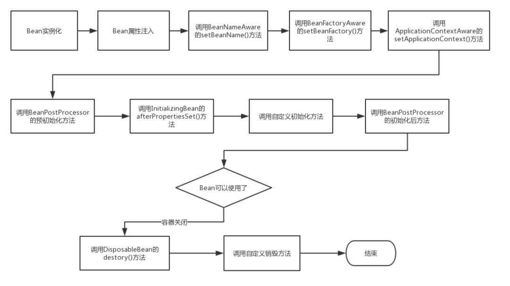

# Spring

[TOC]

## 一、Spring循环依赖相关问题

### 1、spring源码解析之原型模式下的循环依赖

https://blog.csdn.net/lkp_kapila/article/details/105344252

### 2、spring源码解析之单例模式下的构造器循环依赖

https://blog.csdn.net/lkp_kapila/article/details/105347655?spm=1001.2014.3001.5501

### 3、原型模式下，Spring支持循环依赖吗？

答案：不支持，原型模式不会缓存对应的bean实例，自然不会进行循环依赖的处理，具体需要看源码部分，Spring直接抛出异常。

### 4、构造器方式，Spring支持循环依赖吗？

答案：默认不支持，因为Spring循环依赖的处理是在属性填充阶段进行的，具体需要看源码部分，Spring直接抛出异常。
通过在构造器参数中标识@Lazy注解，Spring 生成并返回了一个代理对象是可以解决构造器循环依赖问题的。

Spring构造器注入循环依赖的解决方案是@Lazy，其基本思路是：对于强依赖的对象，一开始并不注入对象本身，而是注入其代理对象，以便顺利完成实例的构造，形成一个完整的对象，

这样与其它应用层对象就不会形成互相依赖的关系；当需要调用真实对象的方法时，通过TargetSource去拿到真实的对象[DefaultListableBeanFactory#doResolveDependency]，然后通过反射完成调用。

### 5、Spring-bean的循环依赖以及解决方式

https://blog.csdn.net/u010853261/article/details/77940767

## 二、Spring IoC和AOP

### 1、DI/IoC

依赖注入（Dependency Injection）和控制反转（Inversion of Control）是同一个概念，具体讲：当某个角色需要另外一个角色协助的时候，在传统的程序设计过程中，通常由调用者来创建被调用者的实例。但在spring中创建被调用者的工作不再由调用者来完成，因此称为控制反转。创建被调用者的工作由spring来完成，然后注入调用者。

因此也称为依赖注入。 spring以动态灵活的方式来管理对象 ，注入的两种方式，设置注入和构造注入。

设置注入的优点：直观，自然

构造注入的优点：可以在构造器中决定依赖关系的顺序。 

### 2、AOP

面向切面编程（AOP）完善spring的依赖注入（DI），面向切面编程在spring中主要表现为两个方面

1.面向切面编程提供声明式事务管理

2.spring支持用户自定义的切面

面向切面编程（aop）是对面向对象编程（oop）的补充， 面向对象编程将程序分解成各个层次的对象， 面向切面编程将程序运行过程分解成各个切面。 
AOP从程序运行角度考虑程序的结构，提取业务处理过程的切面，oop是静态的抽象，aop是动态的抽象，
是对应用执行过程中的步骤进行抽象，从而获得步骤之间的逻辑划分。

aop框架具有的两个特征：

1.各个步骤之间的良好隔离性

2.源代码无关性 

### 3、Bean的生命周期

#### 1.Bean的完整生命周期

如上图所示，Bean的生命周期还是比较复杂的，下面来对上图每一个步骤做文字描述:

1. Spring启动，查找并加载需要被Spring管理的bean，进行Bean的实例化

2. Bean实例化后对将Bean的引入和值注入到Bean的属性中

3. 如果Bean实现了BeanNameAware接口的话，Spring将Bean的Id传递给setBeanName()方法

4. 如果Bean实现了BeanFactoryAware接口的话，Spring将调用setBeanFactory()方法，将BeanFactory容器实例传入

5. 如果Bean实现了ApplicationContextAware接口的话，Spring将调用Bean的setApplicationContext()方法，将bean所在应用上下文引用传入进来。

6. 如果Bean实现了BeanPostProcessor接口，Spring就将调用他们的postProcessBeforeInitialization()方法。

7. 如果Bean 实现了InitializingBean接口，Spring将调用他们的afterPropertiesSet()方法。类似的，如果bean使用init-method声明了初始化方法，该方法也会被调用

8. 如果Bean 实现了BeanPostProcessor接口，Spring就将调用他们的postProcessAfterInitialization()方法。

9. 此时，Bean已经准备就绪，可以被应用程序使用了。他们将一直驻留在应用上下文中，直到应用上下文被销毁。

10. 如果bean实现了DisposableBean接口，Spring将调用它的destroy()接口方法，同样，如果bean使用了destroy-method 声明销毁方法，该方法也会被调用。